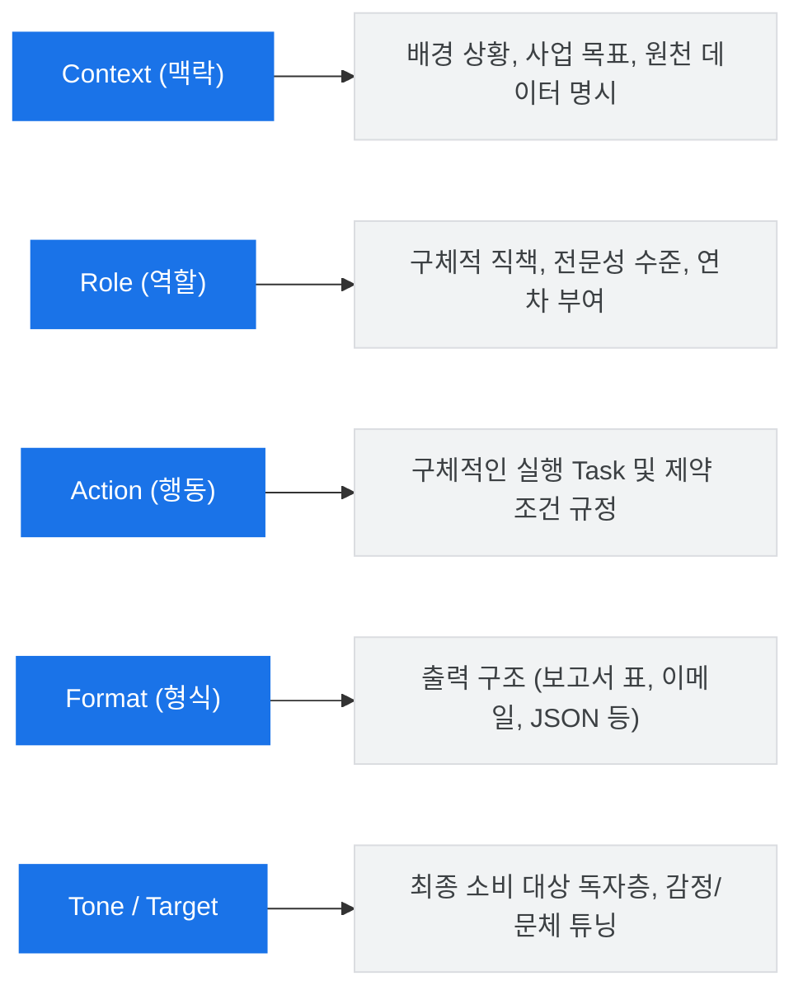

# 💡 Google Gemini Enterprise: C.R.A.F.T 프롬프트 마스터 가이드

> **구글이 공식 권장하는 프롬프트 공학 프레임워크인 C.R.A.F.T를 체계적으로 이해하고, 범용 비즈니스 작성 표준 템플릿을 실제 실무 시나리오로 변환하는 방법을 체득하는 전사 공통 교육 장서입니다.**

단 한 줄의 짧은 지시어만으로는 엔터프라이즈급 비즈니스에서 요구하는 정교하고 깊이 있는 산출물을 안정적으로 획득하기 어렵습니다. 본 마스터 가이드를 통해 제미나이의 언어 추론 잠재력을 200% 이끌어내는 프롬프트 설계의 본질을 학습하십시오.

---

## 🎯 C.R.A.F.T 프레임워크 개요

**C.R.A.F.T**는 구글 클라우드에서 공식 제안하는 5대 핵심 구조화 지시 설계 기법입니다. 제미나이가 입력된 문맥을 다차원적으로 이해하고 고품질 비즈니스 보고서 형태로 정확히 정렬할 수 있도록 보장합니다.



---

## 🏛️ 범용 비즈니스 작성 표준 템플릿의 해부학적 분석 (Anatomy)

사내 모든 부서에서 보고서, 이메일, 기획안, 기술 분석 등을 작성할 때 기본 뼈대로 삼을 수 있는 **'범용 비즈니스 표준 템플릿'**과 각 슬롯별 설계 목적은 다음과 같습니다.

### 📋 범용 비즈니스 표준 템플릿 (Raw Code)

```markdown
[Context]
우리는 현재 ~한 상황에 처해 있으며, 이번 프로젝트의 목적은 ~입니다.
(필요시 아래에 참고할 데이터나 본문을 삽입합니다)
[참고 원천 데이터/텍스트]
"이곳에 원본 데이터 입력"

[Role]
당신은 ~ 분야에서 10년 이상의 경력을 가진 베테랑 ~ 전문가입니다.

[Action]
다음 입력 데이터를 바탕으로 ~를 수행하고, ~ 문제를 해결하기 위한 해결책을 제시해 주세요.

[Format]
결과물은 구조화된 보고서 형태로 작성하되, 다음 요소를 포함해야 합니다:
- 요약 (3줄 이내)
- 주요 문제점 및 원인 분석
- 구체적인 실행 방안 (불릿포인트 형태)

[Tone]
최종 소비자는 경영진이므로, 감정을 배제하고 객관적이며 전문적인 비즈니스 톤을 유지하세요.
```

### 🔍 슬롯별 상세 설계 가이드 및 제미나이 반응 원리

| 프롬프트 구성요소 | 실제 작성 가이드라인 | 제미나이(LLM)의 추론 정합성 반응 원리 |
| :--- | :--- | :--- |
| **`[Context]` (맥락)** | • 현재 부서의 문제 상황, 분석 목적, 의사결정 경로 기술 <br> • 대괄호(`[...]`) 등의 구분자를 사용해 원천 정보 블록을 격리 | AI가 사전 학습한 방대한 지식 중 **해당 비즈니스 도메인 및 주제어와 가장 밀접한 가중치 영역(Vector Space)**을 활성화하여 답변 범위를 좁힙니다. |
| **`[Role]` (역할)** | • 단순한 명사 지양 (예: '마케터' ❌ ➡️ '10년 차 글로벌 프리미엄 브랜드 마케터' ⭕) <br> • 전문가다운 관점과 역량 명시 | LLM은 역할에 따른 페르소나 설정 시 해당 직무에서 자주 쓰이는 전문 비즈니스 용어와 **논리적 구조화 정밀도**를 비약적으로 높여 출력합니다. |
| **`[Action]` (행동)** | • '분석해라', '요약해라' 등 동사형 명령어 위주로 작성 <br> • 우선순위 순으로 번호를 매겨 작업 목록 구체화 | 순서대로 단계를 이행하게 지시하면 제미나이가 내재된 **체인 오브 소트(Chain of Thought, 단계별 생각 추론)**를 자가 기동하여 분석의 누락을 막습니다. |
| **`[Format]` (형식)** | • 보고서, 표(Table), 마크다운, 이메일 양식 등 최종 아웃풋의 구조 정의 <br> • 구체적 열 머리글(Column)이나 불릿 개수 제약 | 출력 형식에 맞춰 문장 생성 확률을 정렬시킵니다. 표를 지정하면 정보 간의 상호 비교 정확도가 가장 높아집니다. |
| **`[Tone]` (어조/독자)** | • 감정을 배제한 전문 비즈니스 개조식 톤 (~함, ~임) <br> • 타겟 독자(경영진, 일반 임직원, 불만 제기 고객) 명시 | 문장의 마지막 어미 처리와 감정적 형용사 사용 비중을 조정하여 **기업 커뮤니케이션 가이드라인에 완벽히 정합되는 텍스트**를 생성합니다. |

---

## 🚀 범용 표준 템플릿 기반 4대 실무 확장 시나리오

위 범용 표준 템플릿의 뼈대를 그대로 유지하면서, **실제 현업 비즈니스 부서에서 즉각 활용할 수 있도록 실무적으로 확장한 4가지 리얼 시나리오와 프롬프트 세트**입니다.

---

### 💻 시나리오 A. 신규 사업 제안서 기획 (기획처 / 전략본부)

> [!NOTE]
> **확장 설계 배경**
> - 신규 아이디어를 단순 발산하는 것이 아닌, 실제 대기업 기획 심의회에 즉시 올릴 수 있을 수준의 **구체적 추진 계획, 예산 타당성, 정량/정성적 지표**가 구조적으로 도출되도록 범용 템플릿을 확장했습니다.

#### 📝 실제 맞춤형 프롬프트 (Copy & Paste 가능)
```markdown
[Context]
우리 회사는 다가오는 2027년 탄소 중립 규제 도입에 발맞춰 사내 물류 및 통근 버스를 '친환경 전기/수소 모빌리티'로 전면 전환하고, 남는 유휴 부지를 활용한 '스마트 하이브리드 충전소 및 전사 탄소 저감 가치 전파 캠페인'을 기획하고 있습니다. 이 프로젝트의 목적은 경영진에게 전사 ESG 전환의 실질적인 투자 타당성을 설득력 있게 기획안으로 제안하는 것입니다.

[Role]
당신은 글로벌 친환경 완성차 브랜드 및 인프라 설계 분야에서 15년 이상의 경력을 쌓은 ESG 전략본부 소속의 수석 전략 기획 전문가입니다. 예산 절감 효율과 규제 컴플라이언스 관점에 날카로운 안목을 갖고 있습니다.

[Action]
제시된 추진 방향을 바탕으로 경영진 보고용 '친환경 모빌리티 인프라 전환 추진 기획서' 초안을 수립해 주세요. 특히 사내 유휴 공간을 단순 충전소가 아닌 임직원 복합 친환경 커뮤니티 공간으로 연계하는 창의적인 연쇄 아이디어가 포함되어야 합니다.

[Format]
다음 4가지 구성 요소를 포함하여 매우 가독성이 높은 마크다운 보고서 형태로 작성해 주세요:
1. 사업 개요 및 추진 필요성 (2027년 탄소 규제 컴플라이언스 관점 포함)
2. 공간 연계 하이브리드 충전소 구축 아이디어 및 단계별 실행 프로세스
3. 정량적 탄소 배출 저감 기대효과 및 소요 예산 예측 모델 제안 (보수적/적극적 구분)
4. 임직원 온보딩 및 참여형 탄소 저감 캠페인 활성화 방안

[Tone]
최종 소비자는 이사회 및 최고경영진(C-Level)이므로, 지나치게 기술적이고 세부적인 사양 설명은 피하고, 비즈니스 가치와 비용 대비 효율성에 초점을 둔 극도로 객관적이고 세련된 경영 비즈니스 톤으로 개조식을 가미해 서술하세요.
```

---

### 💻 시나리오 B. 고객 불만 및 클레임 극복 메일 작성 (CS / 서비스 운영 부서)

> [!TIP]
> **확장 설계 배경**
> - 기업 평판에 큰 위해를 끼칠 수 있는 결제 오류 및 긴급 점검에 대해 **원인 설명, 파격적 보상안, 재발 방지**가 포함된 사과문을 정중하면서도 당당하게 작성할 수 있도록 범용 템플릿의 Tone과 Format을 고도화했습니다.

#### 📝 실제 맞춤형 프롬프트 (Copy & Paste 가능)
```markdown
[Context]
당사가 운영 중인 글로벌 원격 협업 서비스 'SpaceWork'의 서버 통신 모듈 오류로 인해 월요일 오전 9시부터 11시까지 총 2시간 동안 전사 접속 지연 및 유료 요금제 사용자들의 실시간 회의 끊김 장애가 발생했습니다. 해당 시간대 유저들의 클레임 인입률이 평소 대비 400% 급증한 심각한 서비스 가치 훼손 상황입니다.

[Role]
당신은 고객 서비스 복구 및 평판 복원 기획 업무를 12년간 전담하며, 치명적인 대고객 사고 사과문을 통해 오히려 브랜드 충성도를 반전시킨 이력을 가진 글로벌 CS 및 브랜드 홍보 총괄 실장입니다.

[Action]
지정된 접속 지연 장애 데이터를 바탕으로, 유료 요금제 구독 임직원 고객들에게 발송할 '정중하고 진정성 있는 공식 사과문 및 보상 대책 안내 이메일' 초안을 기획하세요.

[Format]
이메일 양식으로 출력하되, 다음 흐름이 완벽히 인지되도록 문장간 공백을 넉넉히 두어 구성하세요:
- 메일 제목 : 정중하면서도 본질이 명확한 제목 3종 옵션 제시
- 도입부 : 상황 인지 시점 및 원인 파악 내역에 대한 투명한 공유
- 사과 및 공감 : 장애로 겪은 업무적 지장에 대한 주체적이고 진정성 있는 사과 표현
- 보상안 : 요금 감면 또는 무료 이용권 연장 등 실제 수용 가능한 대고정 보상 세부안 명시
- 종결부 : 재발 방지 약속 및 시스템 강화 약속 멘트

[Tone]
어설픈 변명이나 감정 호소는 철저히 배제하되, 고객의 업무 불편에 전적으로 공감하는 극도로 정중하며 겸허한 사과의 톤을 유지하세요. 동시에 기술적 원인을 단호하게 파악하고 완벽히 통제하고 있다는 신뢰감 있고 프로페셔널한 어조를 취하십시오.
```

---

### 💻 시나리오 C. 보도자료 분석 및 SWOT 전략 기획 (마케팅 / 대외 홍보 부서)

> [!IMPORTANT]
> **확장 설계 배경**
> - 복잡하고 방대한 원본 보도자료 텍스트를 입력 데이터로 준 뒤, 이를 **SWOT(강점·약점·기회·위협) 프레임워크** 및 액션 아이템으로 즉시 전처리할 수 있도록 범용 템플릿의 Action 부분을 집중 확장했습니다.

#### 📝 실제 맞춤형 프롬프트 (Copy & Paste 가능)
```markdown
[Context]
최근 경쟁사 및 시장 기관에서 발표한 친환경 소형 이동형 로봇(AGV/AMR)의 기술 사양 및 물류 시장 확장 소식을 담은 대외 공식 보도자료가 배포되었습니다. 이번 프로젝트의 목적은 배포된 보도자료 내용을 빠르게 추출하여, 당사 마케팅 및 제품 혁신팀이 취해야 할 대응 시나리오를 도출하는 것입니다.
[원본 보도자료 원천 데이터]
"로보틱스 전문 기업인 Boston Dynamics가 물류 창고 자동화를 위한 차세대 AMR 로봇 'Stretch'의 실시간 하역 성능을 30% 격상한 신모델을 공개했습니다. 이 로봇은 최대 23kg의 상자를 매시간 800개 이상 정밀하게 하역할 수 있는 고성능 3D 비전 센서와 특수 흡착 그리퍼를 완비하고 있습니다. 특히 클라우드 기반 플릿 매니지먼트(Fleet Management)를 통해 1개 제어판에서 최대 100대의 로봇 동선을 충돌 없이 최적화 제어할 수 있는 점이 이번 제품의 시장 지배적 무기로 부각되고 있습니다."

[Role]
당신은 다국적 물류 자동화 솔루션 기업에서 10년 이상 제품 기획 및 대외 경쟁사 분석(CI) 업무를 담당하며, 시장 보도 기술 명세서에서 위협과 시장 대응 인사이트를 날카롭게 발굴하는 수석 마케팅 애널리스트입니다.

[Action]
제시된 원본 보도자료 텍스트를 입체적으로 스캔하고 정밀 팩트 체킹하여, 당사 제품 설계 및 마케팅 추진 조직이 긴급 참고해야 할 SWOT 경쟁 대응 보고서를 빌딩하세요.

[Format]
최종 결과물은 다음 요소를 완벽히 준수해 마크다운 표 및 불릿 구조로 제시하세요:
- 3줄 핵심 팩트 요약
- 경쟁사 신모델의 SWOT 매트릭스 표 (Strengths, Weaknesses, Opportunities, Threats)
- 당사가 즉각 기동할 수 있는 2가지 긴급 마케팅/제품 차별화 전략 제안

[Tone]
주관적인 예측이나 경쟁사에 대한 과소평가는 배제하고, 철저히 보도 내용 및 공학적 스펙에 기반한 중립적이고 예리한 전문 컨설턴트 스타일의 논리적인 톤을 확립하십시오.
```

---

### 💻 시나리오 D. IT 서비스 기술 장애 포스트모템 보고서 (IT / 시스템 개발 및 보안 부서)

> [!CAUTION]
> **확장 설계 배경**
> - 시스템 장애 사후 보고서(Post-Mortem) 작성 시 발생하기 쉬운 중언부언을 차단하고, **발생 시점 타임라인, 근본 원인 분석, 재발 방지를 위한 방어 아키텍처**를 엄격한 개조식 보고 형식으로 규격화하기 위해 범용 템플릿의 Format and Tone을 전면 보강했습니다.

#### 📝 실제 맞춤형 프롬프트 (Copy & Paste 가능)
```markdown
[Context]
어제 일요일 14:00부터 16:30까지 데이터베이스 스토리지 볼륨이 갑작스럽게 꽉 찬 과부하 상태(Full-Disk Crash)가 지속되면서, 자사 핵심 실시간 트랜잭션 API 서비스 전체가 정지(Down)되는 치명적인 시스템 인프라 장애가 발생했습니다. 이 프로젝트의 목적은 장애 상황의 시점별 세부 일지를 도출하고, 근본 원인(RCA)을 파악하여 향후 이중화 및 자동 디스크 스케일아웃(Auto-Scaling)을 포함한 재발방지대책 보고서를 수립하는 것입니다.

[Role]
당신은 금융 거래 플랫폼 및 대용량 트래픽 인프라 환경에서 15년 이상의 설계 및 데브옵스(DevOps) 장애 처리를 총괄 지휘해 온 가용성 극대화 전문 수석 사이트 안정성 엔지니어(Principal SRE)입니다.

[Action]
장애 사건 정황 정보를 바탕으로, 사내 개발 본부장 및 CISO에게 정식 제출할 수 있는 수준의 '장애 사후 분석 및 인프라 이중화 설계 재발방지대책(Post-Mortem)' 정식 공학 문서를 구축해 주세요.

[Format]
공식적인 IT 포스트모템 템플릿 표준에 맞추어 다음 4단 구성으로 작성해 주세요:
1. 장애 메타 정보 및 타임라인 (발생 인지, 긴급 격리, 서비스 정상화 복구 시점 타임라인 표 구성)
2. 근본 원인 분석 (Root Cause Analysis - 왜 모니터링 경보가 적시에 전사 울리지 않았는지 원인 심층 분석)
3. 단기 조치 조율 내역 및 즉각적인 리스크 패치 내역
4. 중장기 재발 방지 자동화 아키텍처 수립 가이드 (스토리지 임계값 초과 시 자동 확장 인프라 구성도 설계 가이드라인 수록)

[Tone]
인간적 실수에 대한 질책이나 책임을 전가하는 표현은 배제하고, 오직 '시스템 프로세스 및 인프라 방어선 취약점 보완'이라는 공학적 개선에만 몰두하는 극도로 차분하고 사실 기반인 SRE 전문 용어 중심의 드라이(Dry)하고 명확한 기술 보고 톤을 견지하십시오.
```

---

## 🧭 C.R.A.F.T 적용 마스터 과정 체크포인트 (자가 진단표)

사용자가 기획서를 작성할 때, 언제 단문 프롬프트를 버리고 C.R.A.F.T 구조화 프롬프트를 도입해야 하는지에 대한 사내 기준표입니다.

```markdown
- [ ] 참조해야 할 데이터의 소스나 문서, 이메일이 최소 2개 이상 유기적으로 얽혀 있는가?
- [ ] 제미나이가 산출한 결과물이 메모나 초안 수준이 아니라, 직속 임원이나 대외 고객에게 즉시 전달할 최종 보고용 마크다운 산출물인가?
- [ ] 특정 보안 규정(PII 비식별화, 기밀 암호화 준칙)이나 마크다운 표 양식 등 무조건 준수해야 하는 엄격한 포맷 및 제약 조건이 포함되어 있는가?
```

> [!TIP]
> **체크포인트 중 1개라도 `YES`에 해당된다면, 반드시 본 마스터 가이드의 범용 템플릿과 4대 시나리오 기법을 이식하여 고정밀 프롬프트를 설계해 사용하십시오.**
