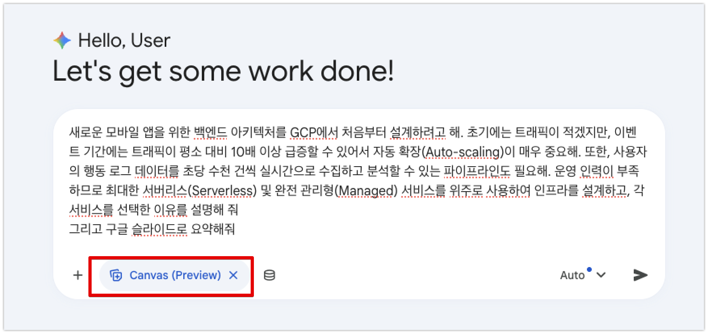
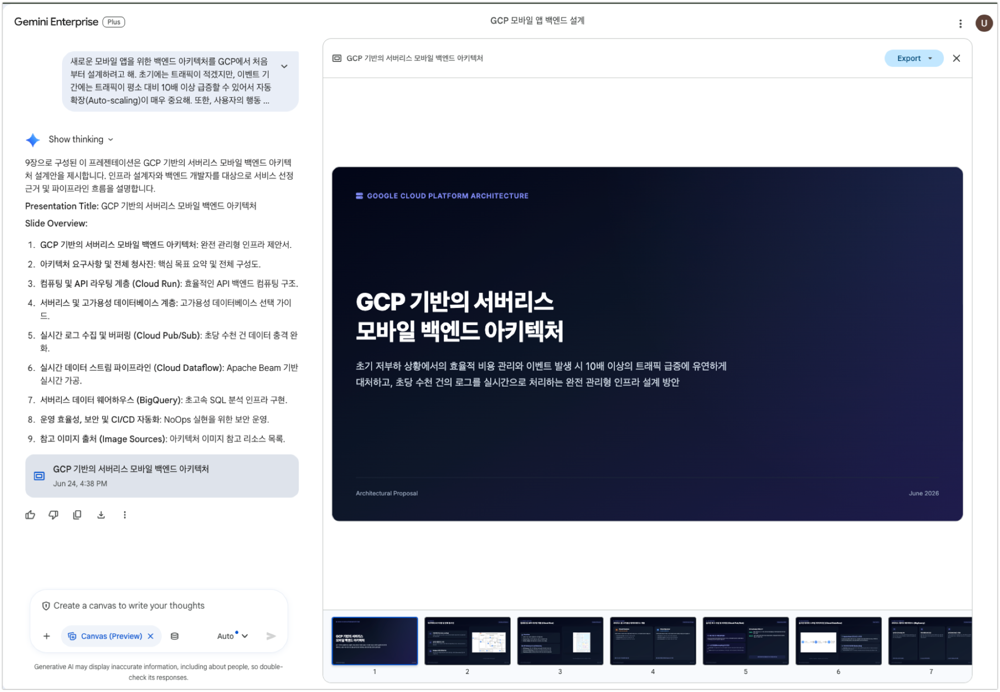
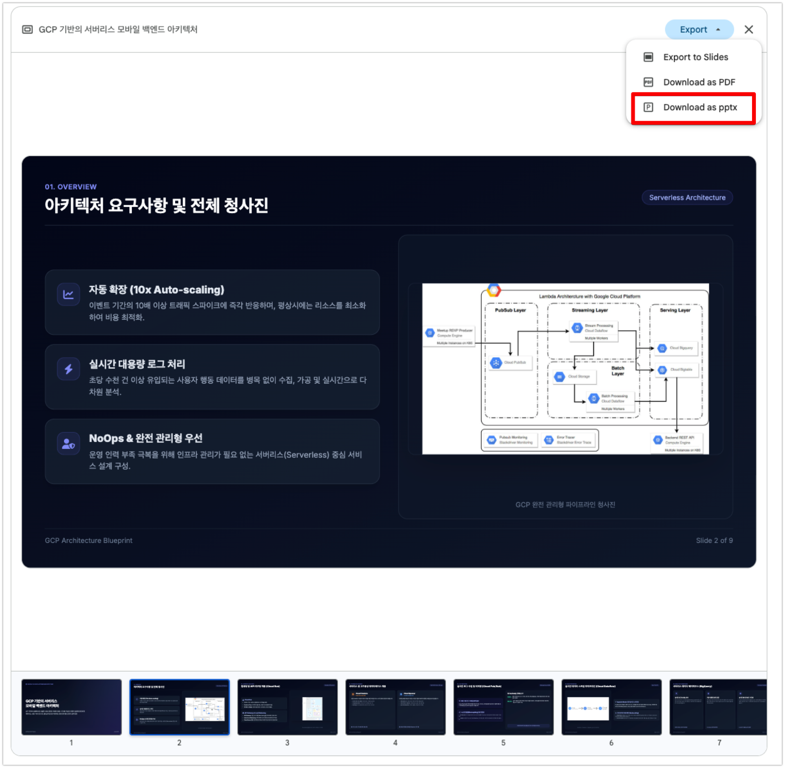
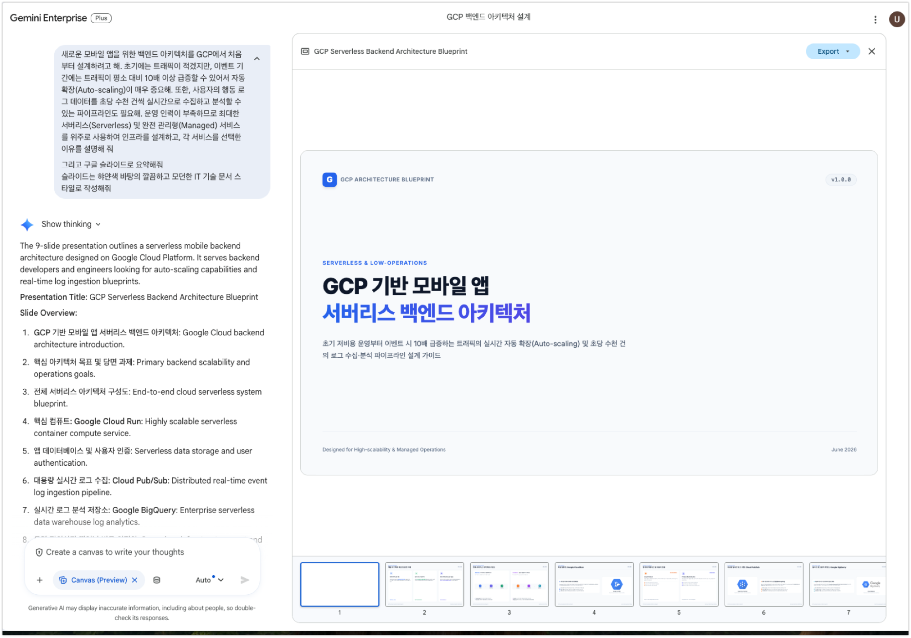
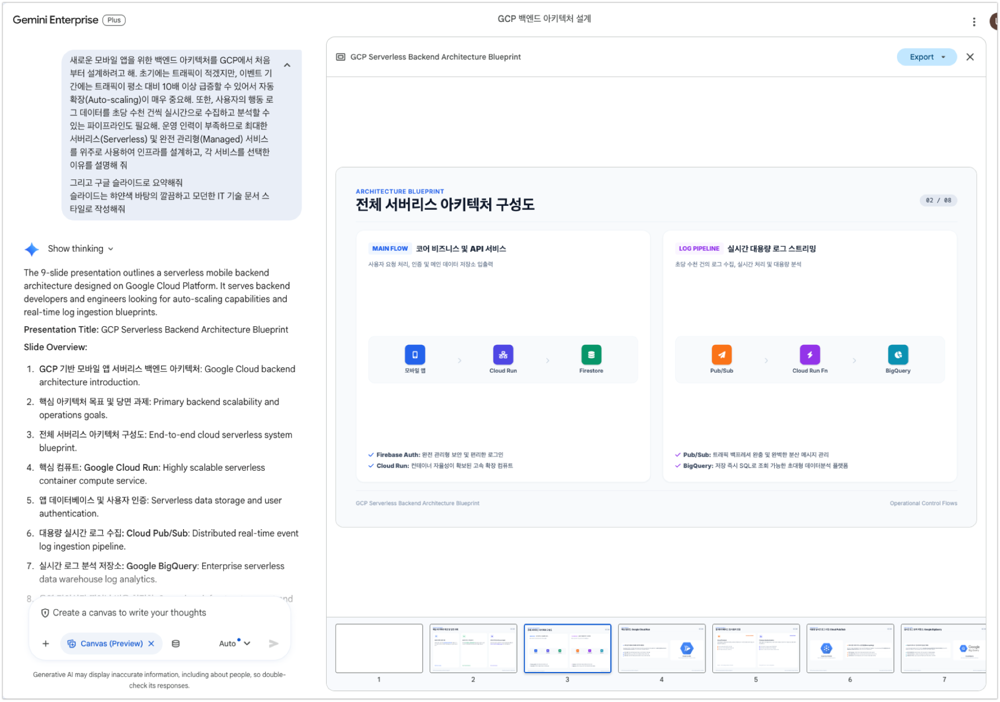
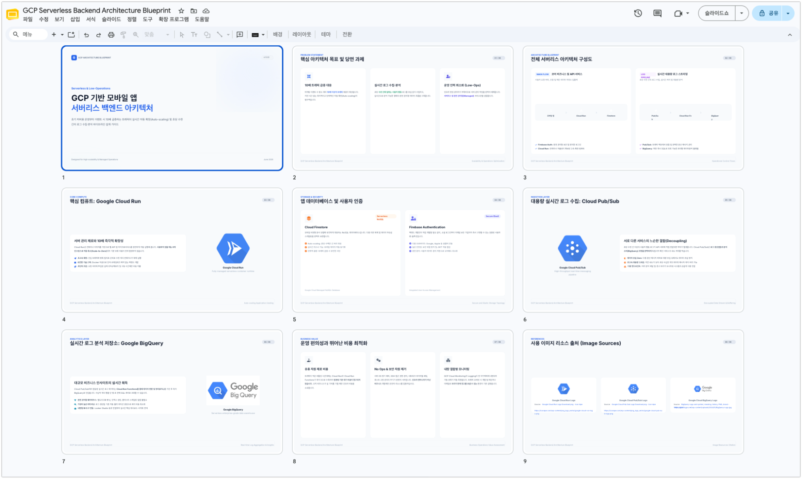
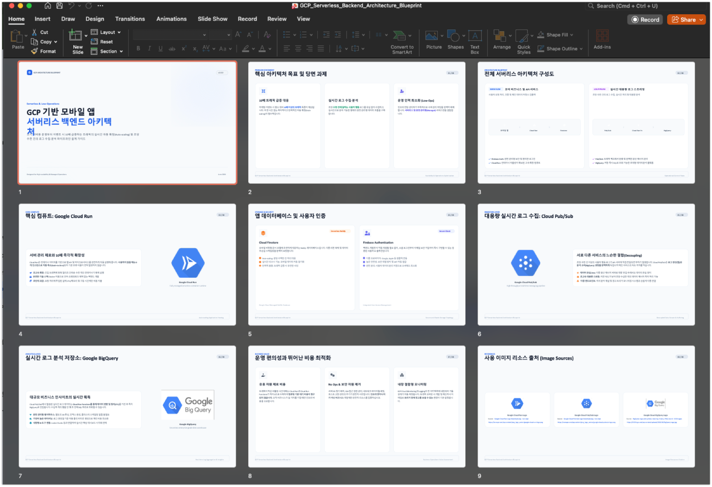
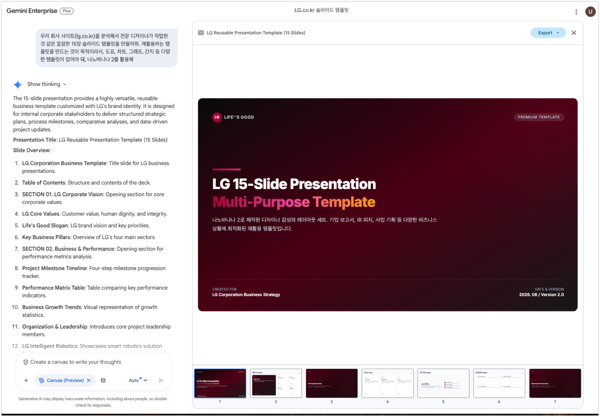
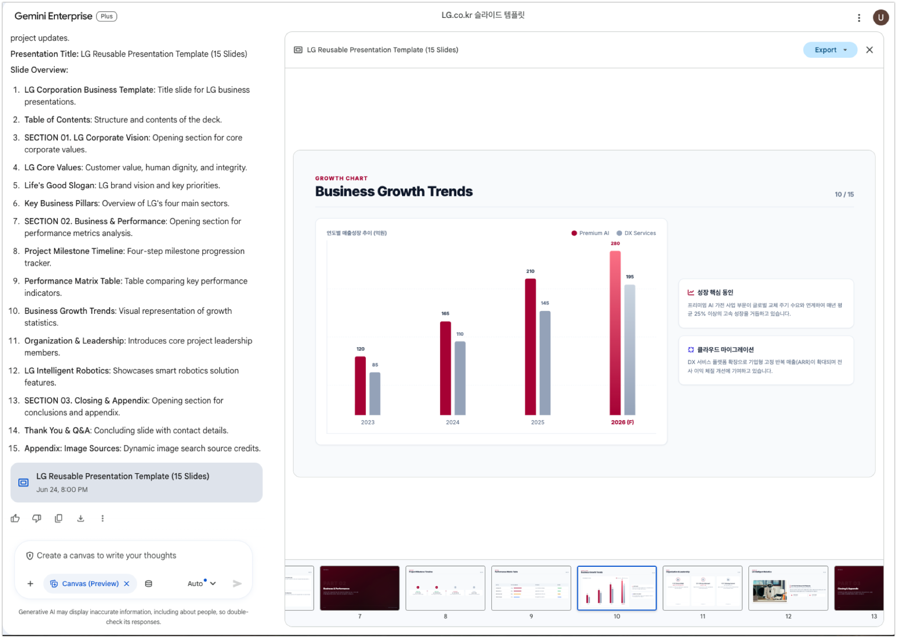

# 🟢 Track 1. Day 1 Value

<div class="track-slide-bar" style="border-color: var(--google-green);">
  <span class="track-slide-label">📋 실습 교육 가이드</span>
  <a href="slide_track1.html" target="_blank" class="track-slide-btn" style="color: var(--google-green);">📽️ 슬라이드로 강의 시작 →</a>
</div>

설치도, 연동도 없이 지금 바로 시작할 수 있는 실습 모음입니다.
오늘 안에 Gemini의 가치를 직접 체험해 보세요.

<div class="download-card">
  <div class="download-card-left">
    <div class="download-icon-box">📥</div>
    <div class="download-text">
      <h4>Track 1 실습 첨부파일 다운로드</h4>
      <p>Gemini 파일 업로드 분석 실습에 활용할 엑셀 데이터 시트(<code>coffee orders.xlsx</code>) 및 프레젠테이션 보고서(<code>202603-BigQuery New Feature Update.pptx</code>)를 다운로드합니다.</p>
    </div>
  </div>
  <div style="display: flex; gap: 8px; flex-wrap: wrap;">
    <a href="samples/coffee orders.xlsx" download="coffee orders.xlsx" class="download-btn">📥 Excel 시트 받기</a>
    <a href="samples/202603-BigQuery New Feature Update.pptx" download="202603-BigQuery New Feature Update.pptx" class="download-btn" style="background: #1558b0;">📥 PPTX 보고서 받기</a>
  </div>
</div>
<div class="verify-card" data-verify-id="track1-data">
  <div class="verify-checkbox"></div>
  <span>실습에 활용할 엑셀 데이터 시트 및 PPTX 프레젠테이션 파일을 내 컴퓨터에 다운로드하였습니다.</span>
</div>

---

## 1.1. 시작하기

본격 시작 전, 나에게 맞는 초기 설정을 잡아봅니다. 강사가 제공한 실습 계정과 URL을 사용합니다.

### 1) 나만의 Gemini Enterprise 설정 (개인화)

1. 화면 좌측 하단의 **Settings & help > Personalization** 메뉴를 클릭합니다.

   

2. 내 직무와 소속에 가장 알맞은 맞춤형 답변을 받을 수 있도록 아래 필수 정보를 입력합니다.
   - **선호하는 이름**: (예: `홍길동 마케터`)
   - **내 직무**: (예: `글로벌 브랜드 마케터`)
   - **우리 회사 산업군**: (예: `자동차 및 모빌리티 (Automotive & Mobility)`)

   

3. 이전 대화 맥락을 기억해 연속적인 고품질 답변을 얻을 수 있도록 <b>Conversation history</b>와 **Reference saved memories** 옵션을 모두 켜 줍니다.

   

> [!TIP]
> **💡 개인화된 컨텍스트(pContext - Personalized Context)란?**
> Gemini Enterprise는 사용자의 업무 환경과 맥락을 깊이 이해하고 가장 적절한 답변을 제공하기 위해, 백그라운드에서 개인 맞춤형 문맥(pContext)을 생성하고 실시간 업데이트합니다. 
> * **4대 분석 대상 소스 (최근 30일 내외 기준)**:
>   1. **Google Workspace** (Calendar, Gmail, Drive) 및 **Office 365** (Outlook, OneDrive)
>   2. **Knowledge Graph** (사내 조직도 및 보고 체계 포함)
>   3. **사용자 개인화 프로필** (설정에서 입력한 선호 이름, 역할, 직무, 산업군)
>   4. **Gemini Enterprise 대화 내역 및 위치 정보**
> * 처음 사용 시 OAuth 인증 및 프로필 작성을 돕는 UI 넛지가 제공되며, 이를 통해 나와 우리 부서에 꼭 맞는 AI 어시스턴트로 진화합니다.

### 2) UI 개인화 메뉴 옵션 추가

1. 메인 화면 하단 또는 좌측에 있는 추가 메뉴 활성화 옵션을 모두 체크(클릭)해 줍니다.

   

2. 메인 대화창 옆에 업무 효율을 올려 줄 **Prompts, Shortcuts, For you, Notebooks** 퀵 메뉴가 정상적으로 나타났는지 확인합니다.

   

## 1.2. AI 어시스턴트 기본 활용 및 협업

Gemini로 실제 업무 결과물을 만들고, 팀원들과 바로 공유하는 흐름을 익혀봅니다.

### 1) 💻 실전 실습 1: 북미/유럽 프리미엄 세단 마케팅 트렌드 분석
글로벌 마케팅 베테랑의 시각을 빌려 시장 경쟁 환경을 파악하고 비즈니스 인사이트를 신속하게 구조화해 보겠습니다.

1. 대화창에 아래의 역할 기반 구조화 프롬프트를 입력합니다.
   ```markdown
   너는 10년차 글로벌 마케팅 전문가야. 최근 북미 및 유럽 시장의 '프리미엄 세단’ 트렌드를 검색해서 요약해줘. 특히 주요 경쟁사들의 최근 마케팅 소구점(Selling Point)를 도출하고, 한국 자동차에 적용할 만한 인사이트를 제시해줘
   ```

   

2. 생성된 결과의 하단에 노출되는 **Source(출처)** 링크를 클릭해 봅니다. Gemini가 답변의 근거로 삼은 공신력 있는 글로벌 시장 분석 리포트 및 뉴스 기사들의 실제 경로를 투명하게 검증할 수 있습니다.

   

3. **인용 및 후속 꼬리 질문(Follow-up)**: 생성된 답변 본문 중에서 마음에 드는 단락이나 수치를 마우스로 드래그하여 선택합니다. 선택 영역에 활성화되는 대화창 넛지 기능을 활용하여 해당 맥락을 담은 후속 꼬리 질문을 끊김 없이 이어나갑니다.
4. **@멘션 기능 및 실시간 다국어 번역/이메일 연동**:
   - **@멘션**: 대화창 입력창에서 `@`를 입력하면 특정 에이전트(예: `@Deep Research`)나 연동된 파일, 사내 문서를 간편하게 불러와 즉각 상호작용할 수 있습니다.
   - **38개 이상 언어 번역 및 이메일 초안 발송**: 글로벌 업무를 위해 38개 이상의 언어로 실시간 번역을 지원하며, 작성된 요약문이나 기획안을 즉시 Gmail 발송용 이메일 초안으로 변환하여 발송할 수 있습니다.
5. **표 데이터 다운로드 및 코드 활용**:
   - 생성된 표 데이터는 상단 옵션을 통해 원클릭으로 엑셀(.xlsx) 파일 등으로 다운로드하거나 클립보드에 복사할 수 있으며, 코드 생성 결과물 역시 바로 복사하여 실무에 적용 가능합니다.

---

### 2) 💻 실전 실습 2: 안전한 대화 세션 공유 및 팀 협업
진행한 대화 세션을 동료 마케터나 팀원들과 링크로 공유해 봅니다.

1. 대화 세션 우측 상단의 **Share** 아이콘을 클릭합니다.

   

2. **Create public link** 링크 생성 창이 실행되면 단축 주소를 복사하여 협업 메신저, 슬랙, 이메일 등을 통해 팀 동료에게 전달해 봅니다.

   

3. **공유 세션 검증**: 전달받은 대화 링크를 브라우저에 열어 이전 맥락이 그대로 유지되는지 확인하고, 추가 질문을 이어 나갑니다.

   

4. 내가 조직 내부나 외부에 공유한 모든 대화 목록은 언제든지 화면 좌측 하단의 **Settings & help > Shared chats** 메뉴에서 통합적으로 조회하고 공유 권한을 회수(삭제)할 수 있습니다.

---

## 1.3. 실시간 웹 검색 그라운딩

Google 검색과 연결된 실시간 그라운딩으로, 최신 뉴스와 정책 변화를 즉시 분석할 수 있습니다.

### 1) 💻 실전 실습 1: EU 전기차 정책 변화 및 한국자동차 글로벌 SWOT 수립
1. 아래 시나리오 쿼리를 옴니바에 붙여넣어 실행해 보겠습니다.
   ```markdown
   2026년 현재 유럽연합(EU)의 전기차(EV) 보조금 정책 변화와 탄소국경조정제도(CBAM) 관련 최신 글로벌 뉴스를 검색해 줘. 이러한 정책 변화가 한국자동차의 유럽 시장 진출에 미칠 영향을 SWOT(강점, 약점, 기회, 위협) 분석 매트릭스 형태로 시각화해서 정리해 줘.
   ```
   *(Gemini가 웹 검색으로 최신 뉴스와 규제 문서를 수집한 뒤 SWOT 분석을 구성합니다.)*

---

### 2) 💻 실전 실습 2: CES 2026 기술 동향 기반 보스톤 다이내믹스 방어 프레임 구성
1. 아래 프롬프트를 실행해 봅니다.
   ```markdown
   최근 열린 'CES 2026'에서 주요 경쟁사들이 발표한 피지컬 AI 기술 및 마케팅 트렌드를 웹 검색으로 분석해 줘. 특히 중국 업체들의 추격 양상을 요약하고, 이를 방어하기 위해 보스톤 다이내믹스가 글로벌 시장을 타겟으로 내세워야 할 핵심 마케팅 메시지를 3줄로 작성해 줘.
   ```

---

### 3) 💻 실전 실습 3: 웹페이지 기반 대화 (Public URL 바인딩 질의)
검색 키워드 입력 외에도, 특정 외부 웹사이트의 전체 내용을 읽고 대화를 나누는 URL 바인딩 기능을 제공합니다.
1. 대화창에 분석하고 싶은 Public 웹페이지 URL을 직접 붙여넣고 지시를 내립니다. (단, 로그인이 필요하거나 접근이 제한된 사이트 제외)
   ```markdown
   다음 웹페이지의 내용을 읽고, 핵심 내용을 3줄로 요약한 뒤 우리 사업에 시사하는 바를 설명해줘: https://blog.google/technology/ai/
   ```

---

## 1.4. 미디어 생성 및 편집

디자인 툴 없이도, 텍스트 하나로 고품질 이미지와 영상을 바로 만들어냅니다. **Nano Banana**(이미지)와 **Veo**(영상)를 직접 써봅니다.

### 1) 💻 실전 실습 1: Nano Banana 모델을 활용한 고품질 비즈니스 포스터 및 아키텍처 변환
자연어 프롬프트와 참조 이미지를 결합해 비즈니스 이미지를 생성해 보겠습니다.

- **실습 가이드 및 메뉴 진입**:
  1. 화면 상단의 **Tools** 또는 기능 선택 패널에서 **Create images (이미지 생성)** 툴을 실행합니다.

     

  2. 이미지 생성 전용 도구 모드가 가동되면 가로세로 비율 조정, 스타일 템플릿(사진, 일러스트 등)을 제어할 수 있는 입력 대기 상태로 전환됩니다.

     

- **시나리오 A: 엔터프라이즈 기능 홍보 포스터 (세로형 9:16 디자인)**:
  비즈니스 임직원들이 Gemini Enterprise를 활용할 수 있는 가이드 포스터를 아래 프롬프트로 출력해 봅니다.
  ```markdown
  Gemini Enterprise를 잘 쓰고 싶어하는 직장인을 위한 팁과 핵심 기능을 알려주는 포스터(비율 9:16)를 그려줘. 내용은 다음을 참고해:
  # Gemini Enterprise 핵심 기능
  - AI Assistant & Web Search: 최신 LLM을 통해 콘텐츠 생성, 코드 작성, 단위 테스트 생성이 가능하며 Google 검색을 실시간 소스로 활용
  - Deep Research: 복잡한 주제에 대해 수백 개의 소스를 스스로 검색 및 분석하여 상세 보고서와 오디오 요약 생성
  - NotebookLM: 업로드한 드라이브 파일, 문서만을 기반으로 요약과 출처 검증이 가능한 리서치 어시스턴트
  - Agent Designer: 코딩 없이 프롬프트와 데이터 설정만으로 맞춤형 AI 에이전트 직접 제작
  - Enterprise Connectors: Gmail, Drive뿐만 아니라 Jira, Confluence 등 외부 시스템 데이터를 완벽 연동
  - Media Generation: 텍스트 프롬프트로 기업용 고해상도 이미지 및 시네마틱 동영상 즉각 생성
  ```
  *(참고: Nano Banana가 텍스트 내용을 바탕으로 포스터 이미지를 생성합니다.)*

   

- **시나리오 B: 손그림 스케치를 클라우드 정밀 아키텍처 다이어그램으로 변환 (Image-to-Image)**:
  손으로 그린 임시 구상도를 업로드하여, 프로페셔널한 기업용 아키텍처 다이어그램으로 일관성 있게 재구성하는 실무 지향적 기법입니다.
  1. 실습용 손그림 샘플 파일(<a href="./samples/handwrite_arch.png" target="_blank">handwrite_arch.png</a>)을 첨부창에 업로드합니다.
  2. 이미지 생성 도구(Create images)를 선택한 뒤 아래 지시어를 실행합니다.
     ```markdown
     첨부한 아키텍처를 Google Cloud Architecture 스타일로 전문적이고 세련되게 다시 그려줘.
     ```

     

- **시나리오 C: 개인 인물 사진을 LEGO 미니피규어 패키지로 변환 (Creative Transformation)**:
  인물 이미지를 레고 패키지 상품 디자인으로 변환하고 주변 환경을 아이소메트릭 스타일로 구성해 봅니다.
  1. 나의 사진이나 연예인 사진을 업로드합니다.
  2. 아래 스타일 변환 프롬프트를 입력합니다.
     ```markdown
     사진 속 인물을 아이소메트릭(isometric) 시점의 LEGO 미니피규어 포장 상자 스타일로 변환하세요. 상자에는 "Gemini Enterprise Hands on Workshop"라는 제목의 라벨을 붙이세요. 상자 안에는 사진 속 인물을 기반으로 한 LEGO 미니피규어와 함께 화장품, 가방 등 필수 소품을 LEGO 액세서리로 전시하세요. 상자 옆에는 포장을 뜯은 실제 LEGO 미니피규어 자체도 사실적이고 생생한 스타일로 전시하세요.
     ```

---

### 2) 💻 실전 실습 2: Veo 모델을 활용한 영상 생성
비디오 생성 도구 모드에서 아래 프롬프트를 실행해 루프 영상을 생성해 보겠습니다. 가이드 내 예시는 정적 스크린샷(.png)으로 구성되어 있습니다.

- **시나리오 A: 프리미엄 럭셔리 향수 브랜드 브랜딩 광고 (돌리 레프트 기법)**:
  ```markdown
  향수병을 소개하는 고급스러운 홍보 영상을 만드세요. 호박색 액체로 채워진 투명한 유리 향수병의 각진 마개에 초점을 맞춰 밀착한 클로즈업 돌리 레프트 샷으로 동영상을 시작합니다. 유리병에 물방울이 은은하게 맺혀 있습니다. 병은 욕실의 깔끔한 흰색 대리석 위에 놓여 있습니다. 배경의 창문에서 부드러운 자연광이 흘러들어와 장면을 비춥니다. 유칼립투스 잎과 천연 나무 향의 디퓨저 스틱이 병 주위로 튀지 않게 배치되어 있습니다. 전체적으로 우아하고 신선하며 세련된 분위기입니다.
  ```

  

- **시나리오 B: 푸드 카테고리 광고 연출 (매크로 슬로우 모션 기법)**:
  ```markdown
  꽉 눌려 짜지는 육즙 가득한 치즈버거의 익스트림 클로즈업 매크로 샷
  - 상세 묘사: 녹아내린 치즈가 옆으로 천천히 흘러내림. 김이 모락모락 피어오름
  - 촬영 기법: 전문적인 음식 사진 촬영, 하이 키 조명(high key lighting), 4k 해상도, 슬로우 모션
  - 오디오: 지글거리는 소리, 경쾌하고 활기찬 음악
  ```

  

- **시나리오 C: 고해상도 다큐멘터리 연출 (FPV 역동 드론 샷)**:
  ```markdown
  아이슬란드의 거대한 폭포 아래로 하강하는 빠른 FPV 드론 샷.
  - 상세 묘사: 렌즈에 부딪히는 물방울. 안개와 무지개를 통과하며 비행함
  - 촬영 기법: 역동적인 모션 블러, 속도감, 초현실적인 자연 다큐멘터리 스타일
  - 오디오: 세차게 흐르는 물소리, 바람 소리
  ```

  

- **시나리오 D: 레트로 스트리트 감성 캠페인 광고 (90년대 아날로그 VHS 미학)**:
  ```markdown
  1990년대 VHS 미학. 스케이트보더가 교외의 거리에서 카메라를 스쳐 지나가며 빠르게 올리(ollie) 기술을 선보임.
  - 상세 묘사: 수동 촬영 특유의 흔들림, 색 번짐(chroma bleeding), 날짜 스탬프 효과(실제 텍스트는 없음).
  - 오디오: 테이프 노이즈(tape hiss), 보드 바퀴가 노면에 굴러가는 소리, 멀리서 개 짖는 소리.
  - 분위기: 즐겁고 향수를 불러일으키는 에너지.
  ```

  

---

## 1.5. Excel 로컬 파일 업로드 및 매출 다차원 분석

엑셀 파일을 대화창에 올리고 말로 물어보기만 하면 차트와 통계가 나옵니다. 코드 없이, 클릭 없이.

- **실습 파일**: <a href="./samples/coffee%20orders.xlsx" target="_blank">coffee orders.xlsx</a> (위 링크를 클릭해 컴퓨터에 다운로드한 후, 대화 창에 업로드하여 사용합니다.)

> [!IMPORTANT|label: 💡 Excel 분석 헤더 구조화 팁]
> - 엑셀 파일을 업로드하고 정확한 데이터 분석 결과를 얻기 위해서는 <b>열(Column) 헤더가 반드시 첫 번째 행(1행)</b>에 위치해 있어야 합니다. 병합된 셀이나 빈 행이 위에 있는 경우 데이터 형식을 잘못 인지할 수 있습니다.
> - 질문을 입력할 때는 `(주문 완료일)`, `(Orders Total Sales)`처럼 엑셀 시트상에 명시된 컬럼명을 정확히 괄호로 감싸 쿼리하면, 컬럼을 더 정확하게 인식합니다.

> [!TIP]
> **💡 CRAFT 프레임워크 적용 실습 템플릿 (Excel 분석)**
> 아래는 `1.8 프롬프트 작성법`에서 다루는 **CRAFT** 구조(Role → Context → Action → Format)를 Excel 분석에 바로 적용한 예시입니다. 대괄호 `[...]` 안의 내용을 본인의 실제 데이터에 맞게 교체하여 활용하세요.
> ```markdown
> 너는 10년 차 베테랑 [직무/전문가 역할, 예: 데이터 분석가/재무 분석가]야. 
> 업로드한 [파일 유형, 예: 엑셀 매출 현황 시트]를 참조하여, [기준 컬럼명, 예: (매출 발생일)] 기준 [시간 단위, 예: 월별] 매출 트렌드 추이를 분석해 주고, [분류 컬럼명, 예: (제품 카테고리)]별 기여도를 한눈에 볼 수 있도록 시각적 차트와 함께 정리해 줘.
> ```
> 📖 CRAFT/APE/CO-STAR 프레임워크 심화 학습은 **[1.8 프롬프트 작성법](#18-프롬프트-작성법)** 을 참고하세요.

1. **파일 구조 이해**:
   ```markdown
   이 문서로 어떤 분석을 할 수 있는지 알려줘
   ```

   

2. **트렌드 시계열 분석**:
   ```markdown
   (주문 완료일)을 기준으로 일별, 주별, 월별 매출(Orders Total Sales)의 변화를 분석하여 매출이 높은 시기와 낮은 시기를 파악해줘
   ```

   

3. **주문유형 카테고리 기여도 비교**:
   ```markdown
   (주문 유형: Dine-in, Takeaway)에 따라 매출이 어떻게 다른지 분석하여 매장 내 식사와 포장 판매의 비중을 파악해줘
   ```

   

4. **통계적 유의성 검증**:
   ```markdown
   매장 내 식사와 포장 판매의 주문당 평균 매출 차이가 의미 있는지 통계적으로 분석해줘
   ```

   

5. **상품 점유율 파이 차트 생성**:
   ```markdown
   상품별 파이차트를 보여줘
   ```

   

#### 🔍 실습 자가 검증 포인트
- [ ] 엑셀 파일이 업로드된 상태에서 질문을 실행했는가?
- [ ] 월별/일별 매출 변화 추이를 보여주는 시각적 꺾은선 차트가 정상적으로 동적 렌더링되는가?
- [ ] 상품별 기여도를 파악할 수 있는 파이 차트(원형 그래프)가 화면에 출력되는가?
- [ ] 각 수치에 마우스를 올렸을 때 실시간 데이터 값(Tooltip)이 표시되는가?

## 1.6. PowerPoint(PPTX) 보고서 장표 분석 실습

PPTX 파일을 대화창에 끌어다 놓으면, 수십 장 슬라이드를 순식간에 요약·분류해 줍니다.

- **실습 파일**: <a href="./samples/202603-BigQuery%20New%20Feature%20Update.pptx" target="_blank">202603-BigQuery New Feature Update.pptx</a> (위 링크를 클릭해 컴퓨터에 다운로드한 후, 대화 창에 업로드하여 사용합니다.)

> [!TIP]
> **💡 CRAFT 프레임워크 적용 실습 템플릿 (PPTX 분석)**
> 아래는 **CRAFT** 구조(Role → Context → Action → Format)를 PowerPoint 분석에 바로 적용한 예시입니다. 대괄호 `[...]` 안의 내용을 본인의 실제 슬라이드 주제에 맞게 교체하여 활용하세요.
> ```markdown
> 너는 10년 차 IT 기술 프리세일즈 아키텍트야. 
> 제공된 PowerPoint 슬라이드에서 [핵심 주제, 예: 신규 발표된 기술 스택 및 기능]을 분석하여 각 핵심 [비교 단위, 예: 기능명/솔루션]별 핵심 요약을 작성하고, 도입 로드맵 상의 [상태 지표 컬럼명, 예: GA/Preview 여부 또는 출시 분기]를 일목요연하게 3열 형태의 비교 표로 구조화하여 요약해 줘.
> ```
> 📖 CRAFT/APE/CO-STAR 프레임워크 심화 학습은 **[1.8 프롬프트 작성법](#18-프롬프트-작성법)** 을 참고하세요.

아래 프롬프트를 입력하여 구조 파싱 및 분류 결과를 검증합니다.
```markdown
BigQuery New Feature 들에 대해서 각 기능별로 기능 요약을 해주고, 기능별로 GA, Preview 여부를 표로 작성해서 보여줘
```


> [!TIP]
> **후속 질문 수행 팁**
> - 생성된 결과를 확인하고 추가적으로 관심 있는 기능(예: "BigQuery의 AI 연동 기능에 대해 더 상세한 구조와 예시를 설명해줘")을 마우스 드래그 혹은 직접 쿼리하여 심화 학습을 수행해 봅니다.

#### 🔍 실습 자가 검증 포인트
- [ ] PPTX 내 슬라이드를 백그라운드 엔진이 정확하게 파싱하여 내용을 추출했는가?
- [ ] 추출된 텍스트 중 핵심 GA(General Availability) 항목과 Preview 상태 항목이 섞이지 않고 정확히 표(Table)로 정형 분류되어 출력되는가?
- [ ] 표 내부의 열이 기능명, 요약, GA/Preview 여부 등으로 구성되어 일목요연하게 비교 가능한가?

---

## 1.7. Canvas를 활용한 구글 슬라이드 자동 생성 및 스타일링

Gemini Enterprise Canvas를 사용하면 대화창에서 입력한 요구사항을 바탕으로 구글 슬라이드 프레젠테이션을 자동 생성하고 원하는 디자인 스타일을 적용할 수 있습니다.



> [!NOTE]
> - 슬라이드 직접 편집 기능은 현재 Private Preview로 제공됩니다.
> - 슬라이드 생성이 끝나면 메뉴에서 구글 슬라이드로 내보내거나 PPTX 파일로 다운로드할 수 있습니다.

### 1) 💻 실전 실습 1: GCP 백엔드 아키텍처 구글 슬라이드 요약 생성

아래 프롬프트를 입력하여 복잡한 인프라 요구사항 분석 결과를 구글 슬라이드 장표 형태로 즉시 자동 생성해 봅니다.

```markdown
새로운 모바일 앱을 위한 백엔드 아키텍처를 GCP에서 처음부터 설계하려고 해. 초기에는 트래픽이 적겠지만, 이벤트 기간에는 트래픽이 평소 대비 10배 이상 급증할 수 있어서 자동 확장(Auto-scaling)이 매우 중요해. 또한, 사용자의 행동 로그 데이터를 초당 수천 건씩 실시간으로 수집하고 분석할 수 있는 파이프라인도 필요해. 운영 인력이 부족하므로 최대한 서버리스(Serverless) 및 완전 관리형(Managed) 서비스를 위주로 사용하여 인프라를 설계하고, 각 서비스를 선택한 이유를 설명해 줘.

그리고 구글 슬라이드로 요약해줘
```



생성된 슬라이드는 오른쪽 상단/하단 메뉴를 통해 PowerPoint(.pptx) 파일로 export할 수 있습니다.



### 2) 💻 실전 실습 2: 기술 문서 스타일 지정 슬라이드 제작

슬라이드의 톤앤매너 및 디자인 스타일 관련 프롬프트를 추가하여 차별화된 디자인 스타일의 프레젠테이션을 생성합니다.

```markdown
새로운 모바일 앱을 위한 백엔드 아키텍처를 GCP에서 처음부터 설계하려고 해. 초기에는 트래픽이 적겠지만, 이벤트 기간에는 트래픽이 평소 대비 10배 이상 급증할 수 있어서 자동 확장(Auto-scaling)이 매우 중요해. 또한, 사용자의 행동 로그 데이터를 초당 수천 건씩 실시간으로 수집하고 분석할 수 있는 파이프라인도 필요해. 운영 인력이 부족하므로 최대한 서버리스(Serverless) 및 완전 관리형(Managed) 서비스를 위주로 사용하여 인프라를 설계하고, 각 서비스를 선택한 이유를 설명해 줘.

그리고 구글 슬라이드로 요약해줘.

슬라이드는 하얀색 바탕의 깔끔하고 모던한 IT 기술 문서 스타일로 작성해줘.
```




Export 메뉴에서 **Google Slide로 내보내기**를 선택하여 생성된 전체 슬라이드를 직접 확인하고 PowerPoint로 다운로드해 봅니다.




### 3) 💻 실전 실습 3: 기업 맞춤형 브랜드 슬라이드 템플릿 제작

기업 웹사이트 구조나 브랜드 가이드라인을 분석하여 다양한 레이아웃(도표, 차트, 그래프, 간지 등)이 포함된 15장 규격 슬라이드 템플릿을 생성합니다.

```markdown
우리 회사 사이트(lg.co.kr)를 분석해서 전문 디자이너가 작업한 것 같은 깔끔한 15장 슬라이드 템플릿을 만들어줘. 재활용하는 템플릿을 만드는 것이 목적이라서, 도표, 차트, 그래프, 간지 등 다양한 템플릿이 있어야 돼.
```




#### 🔍 실습 자가 검증 포인트
- [ ] 구글 슬라이드 요약 프롬프트 입력 시 Canvas 창을 통해 다면 프레젠테이션 장표 구조가 자동 생성되는가?
- [ ] 지정한 톤앤매너(깔끔하고 모던한 IT 기술 문서 스타일 등)가 반영되어 장표 레이아웃 및 폰트/색상이 적절히 구성되는가?
- [ ] Export 메뉴를 통해 Google Slides 내보내기 또는 PowerPoint(.pptx) 다운로드가 원활히 작동하는가?

---

## 1.8. 프롬프트 작성법

프롬프트를 잘 쓰면 결과물의 품질이 달라집니다. 실무에서 널리 알려져 있는 **C.R.A.F.T** 구조를 중심으로, 지시어의 모호성을 줄이고 원하는 답변을 정확히 얻는 법을 본 교육에서 심층적으로 알아보겠습니다.

### 1) 프롬프트 구조화 프레임워크 비교 (APE vs CRAFT vs CO-STAR)
업무의 난이도와 목적에 따라 가장 적합한 프롬프트 프레임워크를 선택하여 활용할 수 있습니다.

| 프레임워크 | 구성 요소 및 정의 | 핵심 특징 및 적합한 업무 |
| :--- | :--- | :--- |
| **APE** | • **A**ction (행동): 수행할 작업 또는 미션 지정<br>• **P**urpose (목적): 요청하는 배경 및 이유<br>• **E**xpectation (기대): 원하는 응답 결과의 형태 | • 복잡성이 요구되지 않는 **단순하고 빠른 즉답 및 요약**에 최적화.<br>• 예: 기사 요약, 간단한 데이터 분류, 짧은 발표 스크립트 도출 |
| **CRAFT** | • **C**ontext (맥락): 배경지식 및 비즈니스 환경<br>• **R**ole (역할): 구체적 직무/연차 등 전문 페르소나<br>• **A**ction (행동): 명확한 동사로 핵심 미션 지시<br>• **F**ormat (형식): 표, 보고서, 불릿 등 출력 구조<br>• **T**one/Target (어조/대상): 최종 청중 및 톤앤매너 | • **정형화된 업무 보고서, 제안서, 공식 이메일** 작성의 표준 프레임워크.<br>• 프롬프트를 5가지 영역으로 나누어 AI에게 특정 역할을 부여하는 데 특화. |
| **CO-STAR** | • **C**ontext (맥락): 작업 배경 및 도메인 정보<br>• **O**bjective (목표): 달성하고자 하는 비즈니스 목표<br>• **S**tyle (스타일): 글의 문체 (기술문서, 블로그 등)<br>• **T**one (어조): 감정 및 태도 설정<br>• **A**udience (청중): 독자의 수준 및 직무 역할<br>• **R**esponse (응답): 최종 출력 포맷 | • 마케팅 카피, 홍보 문구, 콜드 메일 등 **결과물의 스타일과 톤을 극도로 정교하고 세밀하게 통제**해야 할 때 사용되는 고도화 기법. |

#### 💡 프레임워크별 실전 예제

##### 1) APE 프레임워크 예시 (단순 요약 및 발표 준비)
```markdown
[Action] 이 기사를 요약하세요.
[Purpose] 학교 수업 시간에 2분 정도 발표를 해야 해요.
[Expectation] 주요 토픽을 다루는 3개의 글머리 단락(Bullet points)으로 나누어 응답하세요.
```

##### 2) CRAFT 프레임워크 예시 (모바일 앱 런칭 게릴라 마케팅 기획)
```markdown
[Context]: 우리는 다음 주에 새로운 모바일 앱 출시를 앞두고 있고, 마케팅 예산이 제한적인 상황이야.
[Role]: 너는 IT 스타트업의 10년 차 수석 마케팅 전략가야.
[Action]: 제한된 예산으로 실행 가능한 게릴라 마케팅 아이디어 3가지를 제안해줘.
[Format]: 가장 중요한 순서대로 3개의 핵심 행동 지침을 불릿 포인트로 정리하고, 각 항목 하단에 기대 효과를 표로 요약해줘.
[Tone]: 임원 보고용 보고서이니 전문적이고 격식 있는 어조로 작성해줘. (또는 "비개발자 부서원들이 읽을 예정이니 기술 전문 용어는 쉽게 풀어써줘.")
```

##### 3) CO-STAR 프레임워크 예시 (SaaS 신사업 제안서 및 B2B 콜드 메일)
```markdown
[Context]: 우리는 신사업 제안서 중 시장 분석 파트를 작성 중입니다. (또는 SaaS 협업 툴 신규 출시 상황)
[Objective]: 무료 체험판 가입을 유도하고 경영진을 설득하는 것이 목적입니다.
[Style]: 격식 있고 논리적인 보고서 스타일 및 B2B 카피라이팅 문체.
[Tone]: 신뢰감 있고 객관적이며, 상대방의 업무적 페인 포인트를 설득력 있게 짚어내는 톤.
[Audience]: 비전문가인 임원진 및 IT 기업의 팀장급 의사결정권자.
[Response]: 표 1개와 한 줄 요약이 포함된 400자 이내의 이메일 초안 포맷.
```

### 2) 🚀 가독성을 높이는 고정밀 프롬프트 구조화 3대 팁
단순히 줄글로 요소를 나열하는 것보다, 모델이 지시사항을 100% 명확히 인식하도록 아래 3가지 구조화 기법을 적용하세요.

1. **마크다운 헤더 (`#`, `##`, `*`) 사용하기**: 주제와 세부 지시사항을 시각적으로 분리하면 LLM이 각 영역의 의미를 정확히 파악합니다.
2. **구분자 (`[ ]`, `<tags>`) 활용하기**: 텍스트 데이터나 참조 문서 등 '입력 데이터'와 AI가 수행할 '명령 지시어'를 대괄호나 XML 태그로 구분하여 혼동을 방지합니다.
3. **제약 조건은 프롬프트 '가장 뒤'에 배치하기 (Recency Effect)**: LLM은 프롬프트의 맨 마지막 줄에 위치한 지시사항에 가장 높은 주의력을 기울입니다. 글자 수 제한, 금지 단어 등 필수 제약 조건은 항상 프롬프트 최하단에 작성하세요.

### 3) 🏛️ 범용 비즈니스 작성 표준 템플릿의 상세 분석

사내 모든 부서에서 보고서, 이메일, 기획안, 기술 분석 등을 작성할 때 기본 뼈대로 삼을 수 있는 <b>'범용 비즈니스 표준 템플릿'</b>과 각 슬롯별 설계 목적은 다음과 같습니다.

#### 📋 범용 비즈니스 표준 템플릿

```markdown
[Context]
우리는 현재 [프로젝트/배경 설명] 상황에 처해 있으며, 이번 작업의 핵심 목적은 [달성 목표]입니다.

[Role]
당신은 [해당 도메인] 분야에서 10년 이상의 실무 경력을 가진 베테랑 [전문 직무/페르소나]입니다.

[Action]
첨부된 입력 데이터를 바탕으로 [수행할 핵심 과제]를 실행하고, [문제 해결 방안]을 제시해 주세요.

[Format]
결과물은 구조화된 보고서 형태로 작성하되, 다음 요소를 포함해야 합니다:
- 핵심 요약 (3줄 이내) / 세부 실행 방안 (불릿포인트) / 비교 분석 (Table 표 형식)

[Tone]
최종 독자는 [경영진/고객/부서원]이므로, [전문적/객관적/친근한] 비즈니스 어조를 유지하세요.
```

#### 🔍 슬롯별 상세 설계 가이드 및 Gemini 반응 원리

| 프롬프트 구성요소 | 실제 작성 가이드라인 | Gemini(LLM)의 추론 정합성 반응 원리 |
| :--- | :--- | :--- |
| **`[Context]` (맥락)** | • 현재 부서의 문제 상황, 분석 목적, 의사결정 경로 기술 <br> • 대괄호(`[...]`) 등의 구분자를 사용해 원천 정보 블록을 격리 | AI가 사전 학습한 방대한 지식 중 <b>해당 비즈니스 도메인 및 주제어와 가장 밀접한 가중치 영역(Vector Space)</b>을 활성화하여 답변 범위를 좁힙니다. |
| **`[Role]` (역할)** | • 단순한 명사 지양 (예: '마케터' ❌ ➡️ '10년 차 글로벌 프리미엄 브랜드 마케터' ⭕) <br> • 전문가다운 관점과 역량 명시 | LLM은 역할 페르소나 설정 시 해당 직무의 전문 용어와 논리 구조를 반영하여 출력합니다. |
| **`[Action]` (행동)** | • '분석해라', '요약해라' 등 동사형 명령어 위주로 작성 <br> • 우선순위 순으로 번호를 매겨 작업 목록 구체화 | 순서대로 단계를 이행하게 지시하면 Gemini가 내재된 <b>체인 오브 소트(Chain of Thought, 단계별 생각 추론)</b>를 자가 기동하여 분석의 누락을 막습니다. |
| **`[Format]` (형식)** | • 보고서, 표(Table), 마크다운, 이메일 양식 등 최종 아웃풋의 구조 정의 <br> • 구체적 열 머리글(Column)이나 불릿 개수 제약 | 출력 형식에 맞춰 문장 생성 확률을 정렬시킵니다. 표를 지정하면 정보 간의 상호 비교 정확도가 가장 높아집니다. |
| **`[Tone]` (어조/독자)** | • 감정을 배제한 전문 비즈니스 개조식 톤 (~함, ~임) <br> • 타겟 독자(경영진, 일반 임직원, 불만 제기 고객) 명시 | 어미 처리와 형용사 사용 비중을 조정하여 지정된 어조에 맞는 텍스트를 생성합니다. |

---

### 4) 🚀 범용 표준 템플릿 기반 4대 실무 확장 시나리오

위 범용 표준 템플릿의 뼈대를 그대로 유지하면서, <b>실제 현업 비즈니스 부서에서 즉각 활용할 수 있도록 실무적으로 확장한 4가지 리얼 시나리오와 프롬프트 세트</b>입니다.

---

#### 💻 시나리오 A. 신규 사업 제안서 기획 (기획처 / 전략본부)

> [!NOTE]
> **확장 설계 배경**
> - 신규 아이디어를 단순 발산하는 것이 아닌, 실제 대기업 기획 심의회에 즉시 올릴 수 있을 수준의 <b>구체적 추진 계획, 예산 타당성, 정량/정성적 지표</b>가 구조적으로 도출되도록 범용 템플릿을 확장했습니다.

##### 📝 실제 맞춤형 프롬프트
```markdown
[Context]
우리 회사는 다가오는 2027년 탄소 중립 규제 도입에 발맞춰 사내 물류 및 통근 버스를 '친환경 전기/수소 모빌리티'로 전면 전환하고, 남는 유휴 부지를 활용한 '스마트 하이브리드 충전소 및 전사 탄소 저감 가치 전파 캠페인'을 기획하고 있습니다. 이 프로젝트의 목적은 경영진에게 전사 ESG 전환의 실질적인 투자 타당성을 설득력 있게 기획안으로 제안하는 것입니다.

[Role]
당신은 글로벌 친환경 완성차 브랜드 및 인프라 설계 분야에서 15년 이상의 경력을 쌓은 ESG 전략본부 소속의 수석 전략 기획 전문가입니다. 예산 절감 효율과 규제 컴플라이언스 관점에 날카로운 안목을 갖고 있습니다.

[Action]
제시된 추진 방향을 바탕으로 경영진 보고용 '친환경 모빌리티 인프라 전환 추진 기획서' 초안을 수립해 주세요. 특히 사내 유휴 공간을 단순 충전소가 아닌 임직원 복합 친환경 커뮤니티 공간으로 연계하는 창의적인 연쇄 아이디어가 포함되어야 합니다.

[Format]
다음 4가지 구성 요소를 포함하여 매우 가독성이 높은 마크다운 보고서 형태로 작성해 주세요:
1. 사업 개요 및 추진 필요성 (2027년 탄소 규제 컴플라이언스 관점 포함)
2. 공간 연계 하이브리드 충전소 구축 아이디어 및 단계별 실행 프로세스
3. 정량적 탄소 배출 저감 기대효과 및 소요 예산 예측 모델 제안 (보수적/적극적 구분)
4. 임직원 온보딩 및 참여형 탄소 저감 캠페인 활성화 방안

[Tone]
최종 소비자는 이사회 및 최고경영진(C-Level)이므로, 지나치게 기술적이고 세부적인 사양 설명은 피하고, 비즈니스 가치와 비용 대비 효율성에 초점을 둔 극도로 객관적이고 세련된 경영 비즈니스 톤으로 개조식을 가미해 서술하세요.
```

---

#### 💻 시나리오 B. 고객 불만 및 클레임 극복 메일 작성 (CS / 서비스 운영 부서)

> [!TIP]
> **확장 설계 배경**
> - 기업 평판에 큰 위해를 끼칠 수 있는 결제 오류 및 긴급 점검에 대해 <b>원인 설명, 파격적 보상안, 재발 방지</b>가 포함된 사과문을 정중하면서도 당당하게 작성할 수 있도록 범용 템플릿의 Tone과 Format을 고도화했습니다.

##### 📝 실제 맞춤형 프롬프트
```markdown
[Context]
당사가 운영 중인 글로벌 원격 협업 서비스 'SpaceWork'의 서버 통신 모듈 오류로 인해 월요일 오전 9시부터 11시까지 총 2시간 동안 전사 접속 지연 및 유료 요금제 사용자들의 실시간 회의 끊김 장애가 발생했습니다. 해당 시간대 유저들의 클레임 인입률이 평소 대비 400% 급증한 심각한 서비스 가치 훼손 상황입니다.

[Role]
당신은 고객 서비스 복구 및 평판 복원 기획 업무를 12년간 전담하며, 치명적인 대고객 사고 사과문을 통해 오히려 브랜드 충성도를 반전시킨 이력을 가진 글로벌 CS 및 브랜드 홍보 총괄 실장입니다.

[Action]
지정된 접속 지연 장애 데이터를 바탕으로, 유료 요금제 구독 임직원 고객들에게 발송할 '정중하고 진정성 있는 공식 사과문 및 보상 대책 안내 이메일' 초안을 기획하세요.

[Format]
이메일 양식으로 출력하되, 다음 흐름이 완벽히 인지되도록 문장간 공백을 넉넉히 두어 구성하세요:
- 메일 제목 : 정중하면서도 본질이 명확한 제목 3종 옵션 제시
- 도입부 : 상황 인지 시점 및 원인 파악 내역에 대한 투명한 공유
- 사과 및 공감 : 장애로 겪은 업무적 지장에 대한 주체적이고 진정성 있는 사과 표현
- 보상안 : 요금 감면 또는 무료 이용권 연장 등 실제 수용 가능한 대고정 보상 세부안 명시
- 종결부 : 재발 방지 약속 및 시스템 강화 약속 멘트

[Tone]
어설픈 변명이나 감정 호소는 철저히 배제하되, 고객의 업무 불편에 전적으로 공감하는 극도로 정중하며 겸허한 사과의 톤을 유지하세요. 동시에 기술적 원인을 단호하게 파악하고 완벽히 통제하고 있다는 신뢰감 있고 프로페셔널한 어조를 취하십시오.
```

---

#### 💻 시나리오 C. 보도자료 분석 및 SWOT 전략 기획 (마케팅 / 대외 홍보 부서)

> [!IMPORTANT]
> **확장 설계 배경**
> - 복잡하고 방대한 원본 보도자료 텍스트를 입력 데이터로 준 뒤, 이를 **SWOT(강점·약점·기회·위협) 프레임워크** 및 액션 아이템으로 즉시 전처리할 수 있도록 범용 템플릿의 Action 부분을 집중 확장했습니다.

##### 📝 실제 맞춤형 프롬프트
```markdown
[Context]
최근 경쟁사 및 시장 기관에서 발표한 친환경 소형 이동형 로봇(AGV/AMR)의 기술 사양 및 물류 시장 확장 소식을 담은 대외 공식 보도자료가 배포되었습니다. 이번 프로젝트의 목적은 배포된 보도자료 내용을 빠르게 추출하여, 당사 마케팅 및 제품 혁신팀이 취해야 할 대응 시나리오를 도출하는 것입니다.
[원본 보도자료 원천 데이터]
"로보틱스 전문 기업인 Boston Dynamics가 물류 창고 자동화를 위한 차세대 AMR 로봇 'Stretch'의 실시간 하역 성능을 30% 격상한 신모델을 공개했습니다. 이 로봇은 최대 23kg의 상자를 매시간 800개 이상 정밀하게 하역할 수 있는 고성능 3D 비전 센서와 특수 흡착 그리퍼를 완비하고 있습니다. 특히 클라우드 기반 플릿 매니지먼트(Fleet Management)를 통해 1개 제어판에서 최대 100대의 로봇 동선을 충돌 없이 최적화 제어할 수 있는 점이 이번 제품의 시장 지배적 무기로 부각되고 있습니다."

[Role]
당신은 다국적 물류 자동화 솔루션 기업에서 10년 이상 제품 기획 및 대외 경쟁사 분석(CI) 업무를 담당하며, 시장 보도 기술 명세서에서 위협과 시장 대응 인사이트를 날카롭게 발굴하는 수석 마케팅 애널리스트입니다.

[Action]
제시된 원본 보도자료 텍스트를 입체적으로 스캔하고 정밀 팩트 체킹하여, 당사 제품 설계 및 마케팅 추진 조직이 긴급 참고해야 할 SWOT 경쟁 대응 보고서를 빌딩하세요.

[Format]
최종 결과물은 다음 요소를 완벽히 준수해 마크다운 표 및 불릿 구조로 제시하세요:
- 3줄 핵심 팩트 요약
- 경쟁사 신모델의 SWOT 매트릭스 표 (Strengths, Weaknesses, Opportunities, Threats)
- 당사가 즉각 기동할 수 있는 2가지 긴급 마케팅/제품 차별화 전략 제안

[Tone]
주관적인 예측이나 경쟁사에 대한 과소평가는 배제하고, 철저히 보도 내용 및 공학적 스펙에 기반한 중립적이고 예리한 전문 컨설턴트 스타일의 논리적인 톤을 확립하십시오.
```

---

#### 💻 시나리오 D. IT 서비스 기술 장애 포스트모템 보고서 (IT / 시스템 개발 및 보안 부서)

> [!CAUTION]
> **확장 설계 배경**
> - 시스템 장애 사후 보고서(Post-Mortem) 작성 시 발생하기 쉬운 중언부언을 차단하고, <b>발생 시점 타임라인, 근본 원인 분석, 재발 방지를 위한 방어 아키텍처</b>를 엄격한 개조식 보고 형식으로 규격화하기 위해 범용 템플릿의 Format and Tone을 전면 보강했습니다.

##### 📝 실제 맞춤형 프롬프트
```markdown
[Context]
어제 일요일 14:00부터 16:30까지 데이터베이스 스토리지 볼륨이 갑작스럽게 꽉 찬 과부하 상태(Full-Disk Crash)가 지속되면서, 자사 핵심 실시간 트랜잭션 API 서비스 전체가 정지(Down)되는 치명적인 시스템 인프라 장애가 발생했습니다. 이 프로젝트의 목적은 장애 상황의 시점별 세부 일지를 도출하고, 근본 원인(RCA)을 파악하여 향후 이중화 및 자동 디스크 스케일아웃(Auto-Scaling)을 포함한 재발방지대책 보고서를 수립하는 것입니다.

[Role]
당신은 금융 거래 플랫폼 및 대용량 트래픽 인프라 환경에서 15년 이상의 설계 및 데브옵스(DevOps) 장애 처리를 총괄 지휘해 온 가용성 극대화 전문 수석 사이트 안정성 엔지니어(Principal SRE)입니다.

[Action]
장애 사건 정황 정보를 바탕으로, 사내 개발 본부장 및 CISO에게 정식 제출할 수 있는 수준의 '장애 사후 분석 및 인프라 이중화 설계 재발방지대책(Post-Mortem)' 정식 공학 문서를 구축해 주세요.

[Format]
공식적인 IT 포스트모템 템플릿 표준에 맞추어 다음 4단 구성으로 작성해 주세요:
1. 장애 메타 정보 및 타임라인 (발생 인지, 긴급 격리, 서비스 정상화 복구 시점 타임라인 표 구성)
2. 근본 원인 분석 (Root Cause Analysis - 왜 모니터링 경보가 적시에 전사 울리지 않았는지 원인 심층 분석)
3. 단기 조치 조율 내역 및 즉각적인 리스크 패치 내역
4. 중장기 재발 방지 자동화 아키텍처 수립 가이드 (스토리지 임계값 초과 시 자동 확장 인프라 구성도 설계 가이드라인 수록)
```

---

### 5) 🧭 C.R.A.F.T 적용 체크포인트 (자가 진단표)

언제 단문 프롬프트를 버리고 구조화 프롬프트를 써야 하는지에 대한 기준표입니다.

```markdown
- [ ] 참조해야 할 데이터의 소스나 문서, 이메일이 최소 2개 이상 유기적으로 얽혀 있는가?
- [ ] Gemini가 산출한 결과물이 메모나 초안 수준이 아니라, 직속 임원이나 대외 고객에게 즉시 전달할 최종 보고용 마크다운 산출물인가?
- [ ] 특정 보안 규정(PII 비식별화, 기밀 암호화 준칙)이나 마크다운 표 양식 등 무조건 준수해야 하는 엄격한 포맷 및 제약 조건이 포함되어 있는가?
```

> [!TIP]
> **체크포인트 중 2개 이상 `YES`에 해당된다면, 반드시 본 범용 템플릿과 4대 시나리오 기법을 이식하여 고정밀 프롬프트를 설계해 사용하십시오.**

---

### 6) 🗃️ 직무별 특화 프롬프트 템플릿 (10종)

다양한 현업 도메인에서 즉시 조립해 사용할 수 있는 특화 페르소나형 프롬프트 목록입니다.

<details>
<summary><b>1. B2B 마케팅 콜드 메일 작성 (Platform Marketer)</b></summary>

```markdown
[Context]
SaaS 기반의 협업 툴 서비스를 새로 출시했습니다. 초기 인지도를 높이고 무료 체험판 가입을 유도하기 위해 콜드 이메일을 발송하려고 합니다.

[Role]
B2B 기술 마케팅 및 카피라이팅 분야에서 10년 이상 활동하며 높은 오픈율을 기록해 온 전문가의 관점에서 생각하세요.

[Action]
IT 기업의 팀장급 관리자들을 대상으로 제품의 핵심 가치(업무 효율 30% 향상)를 전달하고 미팅을 제안하는 콜드 이메일 초안을 작성해 주세요.

[Format]
이메일 초안에 필요한 구성요소로 작성해 주세요. 전체 길이는 공백 제외 400자 이내로:
- 제목 : 호기심을 유발하는 3가지 옵션
- 본문 : 도입부 - 문제 제기 - 솔루션 제시 - Call to Action)

[Tone]
정중하면서도 지나치게 딱딱하지 않게, 상대방의 업무적 페인 포인트를 정확히 짚어내는 설득력 있는 어조를 구사하세요.
```
</details>

<details>
<summary><b>2. 일반 마케터 (신제품 SNS 캠페인 기획)</b></summary>

```markdown
[Context]
우리 브랜드는 2030 세대를 타겟으로 한 '친환경 제로 웨이스트 샴푸바'를 다음 달 출시합니다. 인스타그램을 주 채널로 활용하여 초기 인지도를 높이고, 공식몰 유입을 늘리기 위한 런칭 캠페인을 준비하고 있습니다.

[Role]
당신은 성수동 팝업 트렌드와 2030 세대의 소비 심리를 꿰뚫고 있는 7년 차 퍼포먼스 및 브랜드 마케터입니다. 트렌디한 카피라이팅과 데이터 기반의 콘텐츠 기획에 능숙합니다.

[Action]
인스타그램 릴스와 카드뉴스에 사용할 콘텐츠 아이디어 3가지를 기획해 주세요. 각 아이디어는 제품의 핵심 셀링 포인트인 '플라스틱 제로'와 '강력한 세정력'이 자연스럽게 녹아있어야 합니다.

[Format]
다음 구조의 Table 형태로 출력해 주세요:
- 콘텐츠 제목 및 콘셉트
- 핵심 메시지 (한 줄 카피)
- 비주얼 연출 방식 (이미지/영상 구성안)
- 유저 참여를 유도하는 CTA(Call to Action)

[Tone]
친환경을 강요하는 진지한 어조는 피하세요. 2030 세대가 공감할 수 있도록 위트 있고 힙한 톤앤매너를 유지하며, 유행하는 밈이나 문체를 살짝 활용해 주세요.
```
</details>

<details>
<summary><b>3. 대학교수 (참여형 수업 설계 및 강의계획)</b></summary>

```markdown
[Context]
저는 대학에서 [마케팅 원론 / AI와 미래 사회 / 전공명 입력]을 가르치는 교수입니다. 이번 학기 수강생은 대부분 대학생활에 갓 적응한 2학년 학부생들입니다. 최근 학생들이 일방적인 이론 주입식 강의에 지루함을 느끼고 있어, 플립러닝(Flipped Learning, 거꾸로 학습)과 조별 프로젝트를 결합한 혁신적인 수업 방식으로 패러다임을 바꾸고자 합니다. 

[Role]
당신은 고등교육 트렌드에 정통하고, 하버드 비즈니스 리뷰(HBR) 스타일의 참여형 수업 설계(Instructional Design)에 능숙한 15년 경력의 교육공학 전문가이자 대학교수입니다.

[Action]
한 학기(16주) 과정 중 중반부에 해당하는 '6주 차부터 10주 차까지의 팀 프로젝트 수행 기간'에 대한 혁신적인 수업 운영 계획을 수립해 주세요. 학생들이 자발적으로 참여하고 팀원 간 갈등을 최소화하며 실무 역량을 키울 수 있는 구체적인 가이드라인이 필요합니다.

[Format]
다음 세 가지 내용을 포함하여 명확한 서술형과 불릿포인트 조합으로 작성해 주세요:
1. 6~10주 차 주차별 수업 주제 및 학생 활동 (주차별 요약)
2. 학생들의 무임승차(Free-riding)를 방지하기 위한 혁신적인 평가 시스템
3. 첫 오리엔테이션 때 학생들에게 배포할 '교수자 메시지' 초안

[Tone]
학문적인 깊이와 격식을 갖추되, 요즘 대학생들의 눈높이에 맞게 권위적이지 않고 동기부여를 줄 수 있는 따뜻하고 열정적인 어조를 유지해 주세요.
```
</details>

<details>
<summary><b>4. 대학교 교직원 (국책사업 신규 프로그램 기획안)</b></summary>

```markdown
[Context]
우리 대학교는 교육부의 '대학 혁신 지원사업' 평가를 앞두고 있습니다. 최근 학령인구 감소와 재학생 중도 탈락률(자퇴율) 증가가 대학의 큰 위기로 다가오고 있습니다. 이에 기획처(또는 학생처) 소속 직원으로서, 재학생들의 소속감을 높이고 진로 방황을 막기 위한 'AI 기반 맞춤형 상시 케어 및 Retention 프로그램'을 신설하여 사업계획서에 반영하고자 합니다.

[Role]
당신은 대학 행정 및 고등교육 정책 기획 분야에서 12년 동안 근무하며, 다수의 교육부 국책사업 선정을 이끌어낸 기획처 소속의 베테랑 행정 전문가로 팀장급입니다. 예산 타당성과 실행 가능성을 날카롭게 분석하는 능력을 갖추고 있습니다.

[Action]
타 대학과 차별화되는 '재학생 중도 탈락 방지 및 대학 적응 프로그램' 아이디어 2가지를 기획해 주세요. 각 아이디어는 예산 규모, 구체적인 실행 프로세스, 그리고 대학 평가 지표(유지충원율) 상승에 어떻게 기여하는지가 명확히 드러나야 합니다.

[Format]
정부 재정지원사업 보고서 표준 양식에 맞추어 다음 구조로 작성해 주세요:
1. 프로그램명 및 추진 배경
2. 주요 내용 및 추진 체계 (단계별 실행 방안)
3. 소요 예산 산출 근거 (예시 포함)
4. 기대 효과 (정량적/정성적 지표 구분)

[Tone]
공문서 및 국책사업 계획서에 적합한 개조식 문체 (~함, ~임, ~구축)를 사용하세요. 매우 객관적이고 논리적이며, 예산 대비 효과가 높음을 강조하는 행정 전문가의 전문적인 어조를 유지해야 합니다. 미사여구는 배제하세요.
```
</details>

<details>
<summary><b>5. 게임 콘텐츠 기획자 (Game Designer)</b></summary>

```markdown
[Context]
당사는 현재 MMORPG '아스트라 온라인'의 여름 대규모 업데이트를 준비 중입니다. 신규 및 복귀 유저(이른바 '뉴비')의 대량 유입이 예상되며, 이들의 게임 정착을 돕고 기존 유저와 어우러질 수 있는 '여름 한정 이벤트 섬'을 기획해야 합니다.

[Role]
당신은 구글게임즈 RPG 소속의 5년 차 콘텐츠 기획자입니다. 아스트라 온라인의 방대한 세계관을 잘 이해하고 있으며, 유저 친화적이고 동화 같은 감성의 퀘스트와 미니게임을 설계하는 데 탁월한 능력을 갖추고 있습니다.

[Action]
여름 시즌 한정으로 오픈할 특별 이벤트 섬의 콘셉트와 주요 콘텐츠 아이디어 3가지를 기획해 주세요. 각 섬의 콘셉트는 여름의 청량함을 담아야 하며, 신규 유저도 쉽게 참여할 수 있는 직관적인 기믹이 포함되어야 합니다.

[Format]
아래 항목을 포함하여 가독성 좋은 표(Table) 형태로 출력해 주세요:
- 이벤트 섬 이름 및 메인 테마
- 스토리라인 요약 (어떤 사건이 벌어지는가?)
- 핵심 미니게임/퀘스트 방식 (예: 물총 쏘기, 서핑 등)
- 최종 보상 및 유저 기대 효과

[Tone]
실제 게임 기획서에 들어갈 수 있도록 창의적이면서도 논리적인 어조를 사용하세요. 판타지 세계관에 어울리는 몰입감 있는 표현을 쓰되, 개발팀과 유관 부서가 즉시 이해할 수 있도록 명확하게 서술해 주세요.
```
</details>

<details>
<summary><b>6. 라이브 서비스 PM (Live Ops PM)</b></summary>

```markdown
[Context]
모바일 RPG '크로노스 세븐' 주말 핫타임 접속 이벤트 도중, 특정 상황에서 유료 재화(영혼석)가 무한 복사되는 치명적인 버그가 발생했습니다. 이를 막기 위해 일요일 오후 황금시간대에 4시간 동안 긴급 점검을 진행했으며, 현재 G플레이(GPlay) 공식 커뮤니티 내 유저들의 불만이 최고조에 달한 위기 상황입니다.

[Role]
당신은 구글게임즈 메가포트 라이브 서비스실의 8년 차 총괄 PM입니다. 수많은 라이브 게임 위기 상황을 겪어왔으며, 유저와의 투명한 소통을 중시하고 진정성 있는 대응으로 무너진 신뢰를 회복하는 데 탁월한 위기관리 전문가입니다.

[Action]
G플레이 공식 커뮤니티에 즉시 업로드할 '긴급 점검 및 버그 발생에 대한 공식 사과문' 초안을 작성해 주세요. 변명보다는 명확한 원인 규명과 조치 내역, 그리고 파격적인 보상안이 중심이 되어야 합니다.

[Format]
다음 구조에 따라 줄바꿈과 굵은 글씨를 활용하여 가독성 있게 작성해 주세요:
1. 사과문 제목 (진정성이 느껴지도록)
2. 상황 설명 (버그 발생 원인 및 악용자 제재 등 현재까지의 조치 내용)
3. 진정성 있는 사과의 메시지
4. 전체 유저 대상 상세 보상안 (아이템명 및 수량 등 구체적 명시)
5. 향후 재발 방지 대책 및 약속

[Tone]
어떠한 변명도 포함하지 않은 매우 정중하고 진정성 있는 사과의 어조를 유지하세요. 화가 난 유저의 감정을 달래는 부드러움과, 악용자에 대한 단호한 운영 조치를 보여주는 단단한 톤을 동시에 구사해야 합니다.
```
</details>

<details>
<summary><b>7. 인디 플랫폼 퍼포먼스 마케터 (Platform Marketer)</b></summary>

```markdown
[Context]
구글게임즈의 인디 게임 플랫폼 'G플레이 인디'에서 압도적으로 긍정적인 평가를 받고 있는 국산 신작 로그라이크 게임을 1개월간 기간 독점 런칭하게 되었습니다. 우리의 핵심 과제는 스팀(Steam) 등 글로벌 플랫폼 이용에 익숙한 국내 코어 인디 게이머들을 G플레이 플랫폼으로 신규 가입시키고 게임 구매를 유도하는 것입니다.

[Role]
당신은 구글게임즈 G플레이 소속 6년 차 퍼포먼스 마케터입니다. 종합 게임 커뮤니티(루리웹, 인벤, 디시인사이드 등)의 밈(Meme)과 게이머들의 심리를 완벽하게 파악하고 있으며, 낮은 단가(CPA)로 높은 유입을 만들어내는 바이럴 캠페인 전문가입니다.

[Action]
코어 게이머들의 흥미를 유발하고 G플레이 플랫폼으로의 회원가입을 유도할 수 있는 참신한 디지털 프로모션 및 바이럴 마케팅 아이디어 2가지를 기획해 주세요. 

[Format]
각 아이디어를 다음 구조의 불릿포인트 형태로 명확하게 정리해 주세요:
- 캠페인 명 및 메인 카피
- 메인 타겟 유저층 (예: 특정 장르 마니아 등)
- 프로모션 메커니즘 (어떻게 참여하고 무엇을 얻는가?)
- G플레이 신규 가입 유도(Call to Action) 전략 및 차별화된 혜택

[Tone]
대기업의 딱딱한 프로모션 톤을 철저히 버리세요. 인디 게이머들의 덕심과 도전 욕구를 자극할 수 있도록 매우 친근하고 재치 있으며, 인터넷 커뮤니티의 힙한 밈이나 게이머 용어를 적재적소에 활용한 트렌디한 어조를 유지해 주세요.
```
</details>

<details>
<summary><b>8. 인사/조직문화팀 사내 캠페인 기획</b></summary>

```markdown
[Context]
최근 그룹 내 여러 스튜디오와 자회사 간의 소통 부족 현상을 해결하고, 개발자·기획자·아트 등 다양한 직군의 임직원들이 창의적인 아이디어를 자유롭게 발산할 수 있도록 2박 3일간의 '제1회 구글게임즈 사내 게임잼(Game Jam)'을 개최하려고 합니다. 참가자들에게는 충분한 포상과 혜택이 주어질 예정입니다.

[Role]
당신은 구글게임즈 홀딩스 인재문화실 소속의 10년 차 조직문화 기획자입니다. 딱딱한 기업 문화를 지양하고 게임사 특유의 자유롭고 수평적이며 열정적인 '구글게임즈 정신'을 조직 내에 불어넣는 사내 캠페인 기획에 탁월한 역량을 가지고 있습니다.

[Action]
이번 사내 게임잼 행사의 핵심 운영안을 기획하고, 전사 임직원들의 호기심을 자극하여 참가를 유도할 수 있는 사내 발송용 이메일 초안을 작성해 주세요. 

[Format]
다음 두 가지 파트로 나누어 출력해 주세요:
1. 행사 기획 요약 (표 형식: 행사 테마, 팀 구성 방식, 우수팀 혜택 포함)
2. 전사 발송용 사내 이메일 초안 (클릭을 유도하는 메일 제목 3가지 옵션 및 행사 안내, Call to Action 포함)

[Tone]
일반적인 대기업 인사팀의 딱딱하고 보수적인 공지 스타일을 철저히 배제하세요. 임직원들의 개발 덕심과 창작 욕구를 자극할 수 있도록, 밝고 에너지 넘치며 친근한(사우들에게 말거는 듯한) 어조를 사용해 주세요.
```
</details>

<details>
<summary><b>9. 재무기획팀 투자 타당성 분석 (Finance / FP&A)</b></summary>

```markdown
[Context]
경영진은 현재 글로벌 시장(북미/유럽)을 타겟으로 하는 신규 AAA급 콘솔/PC 게임 개발 프로젝트에 500억 원 규모의 투자를 검토 중입니다. 개발 기간은 최소 4년이 소요될 예정입니다. 대규모 자본이 장기간 묶이는 만큼, 재무 부서 차원에서 해당 프로젝트의 수익성 및 자금 조달 리스크를 다각도로 검토해야 합니다.

[Role]
당신은 구글게임즈 홀딩스 재무기획실의 7년 차 재무 분석가(FP&A)입니다. 비상장사인 당사의 건전한 재무 구조를 유지하면서도 대형 IP 투자의 효율성을 극대화하기 위해, 감정에 휩쓸리지 않고 데이터를 기반으로 냉철하게 손익을 분석하는 재무 전문가입니다.

[Action]
해당 신규 AAA급 프로젝트의 투자 타당성을 검토하기 위한 '경영진 보고용 원페이저(1-Pager) 재무 분석 보고서'의 목차와 핵심 분석 지표를 기획해 주세요. 투자 회수 시점과 잠재적 재무 리스크 방어 전략이 반드시 포함되어야 합니다.

[Format]
최고경영진(C-Level)이 한눈에 파악할 수 있도록, 군더더기 없는 개조식 불릿포인트 형태로 아래 항목을 포함해 작성해 주세요:
- 프로젝트 재무 분석 개요
- 핵심 재무 평가지표 (ROI, BEP 달성 예상 판매량, NPV 등)
- 단계별 자금 집행(Milestone-based Funding) 계획
- 주요 재무 리스크 및 헷징(Hedging) 시나리오

[Tone]
개발 부서의 낙관적인 전망을 배제하고, 철저하게 숫자와 팩트에 기반한 객관적이고 보수적인 톤을 유지하세요. 경영진의 빠른 의사결정을 돕기 위해 수식어가 없는 명확하고 전문적인 비즈니스 재무 용어를 사용해야 합니다.
```
</details>

<details>
<summary><b>10. 한국자동차 마케터 (신형 전기차 디지털 마케팅 기획)</b></summary>

```markdown
[Context]
한국자동차는 내년 상반기 출시 예정인 차세대 준중형 전기 SUV 'IONIQ 6 페이스리프트' 모델의 사전 디지털 캠페인을 준비 중입니다. 이번 모델은 '주행거리 향상'과 'AI 기반 스마트 콕핏(인포테인먼트) 기능'이 핵심입니다. 마케팅 목표는 기존의 내연기관 차주들과 디지털 기술에 친숙한 2030 세대에게 한국자동차의 '전동화 퍼스트' 이미지를 각인시키는 것입니다.

[Role]
당신은 한국자동차 국내마케팅실 소속의 8년 차 브랜드 마케터입니다. 글로벌 모빌리티 트렌드에 정통하며, 단순한 제원 설명이 아닌 테크와 라이프스타일을 결합한 스토리텔링형 캠페인 기획에 탁월한 역량을 가지고 있습니다.

[Action]
2030 잠재 고객의 이목을 끌 수 있는 디지털 마케팅 아이디어 3가지를 기획해 주세요. 아이디어에는 각각 한국자동차의 브랜드 헤리티지(예: 포니에서 이어지는 혁신)나 친환경 가치, 그리고 차량의 핵심 테크 기능이 자연스럽게 녹아있어야 합니다.

[Format]
다음 요소들을 포함하여 가독성 높은 불릿포인트 형태로 출력해 주세요:
- 캠페인 명 및 메인 콘셉트
- 활용 채널 (예: 유튜브 숏츠, 인스타그램, 팝업스토어 연계 등)
- 상세 실행 방안 (프로그램 및 스토리라인 구성)
- 기대 효과 및 KPI

[Tone]
한국자동차의 글로벌 브랜드 톤앤매너에 맞추어 혁신적이고 미래지향적이면서도, 타겟 고객이 쉽게 공감할 수 있도록 스마트하고 세련된 어조를 유지해 주세요. 너무 무겁거나 정형화된 대기업 스타일의 문구는 지양합니다.
```
</details>

---

