# 🔵 Track 2. Advanced

<div class="track-slide-bar" style="border-color: var(--google-blue);">
  <span class="track-slide-label">📋 실습 교육 가이드</span>
  <a href="slide_track2.html" target="_blank" class="track-slide-btn" style="color: var(--google-blue);">📽️ 슬라이드로 강의 시작 →</a>
</div>

사내 데이터(Google Drive & Workspace)와의 RAG 연동, NotebookLM 팀 도서관 구축, Deep Research 자율 보고서, 그리고 에이전트 빌더를 활용한 맞춤형 AI 업무 파이프라인 구성 실습입니다.

<div class="download-card">
  <div class="download-card-left">
    <div class="download-icon-box" style="background: #e8f0fe; color: #1a73e8;">📦</div>
    <div class="download-text">
      <h4>Track 2 심화 RAG & NotebookLM 실습 파일 다운로드</h4>
      <p>RAG 실습용 내규·가이드라인 PDF 2종, 설명서 실습용 이미지 패키지 1종, 시네마틱 슬라이드 실습용 이미지 패키지 1종, Canvas 동영상 실습용 파일 2종 — 총 6종을 미리 다운로드합니다.</p>
    </div>
  </div>
  <div style="display: flex; gap: 8px; flex-wrap: wrap;">
    <a href="samples/[공통_내규]_넥스트_테크놀로지스_임직원_복리후생_가이드라인.pdf" download class="download-btn" style="background: #1a73e8; padding: 10px 16px; font-size: 0.9rem;">📕 공통 내규 PDF</a>
    <a href="samples/[마케팅_캠페인]_넥스트_테크놀로지스_사내_브랜드_앰버서더_프로그램_가이드라인.pdf" download class="download-btn" style="background: #1a73e8; padding: 10px 16px; font-size: 0.9rem;">📕 마케팅 내규 PDF</a>
    <a href="samples/data_agent.zip" download class="download-btn" style="background: #34a853; padding: 10px 16px; font-size: 0.9rem;">📦 data_agent.zip</a>
    <a href="samples/homestyle.zip" download class="download-btn" style="background: #e8710a; padding: 10px 16px; font-size: 0.9rem;">📦 homestyle.zip</a>
    <a href="samples/canvas.pdf" download class="download-btn" style="background: #9334e6; padding: 10px 16px; font-size: 0.9rem;">📄 canvas.pdf</a>
    <a href="samples/canvas.zip" download class="download-btn" style="background: #9334e6; padding: 10px 16px; font-size: 0.9rem;">📦 canvas.zip</a>
  </div>
</div>
<div class="verify-card" data-verify-id="track2-data">
  <div class="verify-checkbox"></div>
  <span>Track 2 전체 실습에 활용할 샘플 파일 6종(내규·가이드라인 PDF 2종, data_agent.zip, homestyle.zip, canvas.pdf, canvas.zip)을 내 컴퓨터에 다운로드하였습니다.</span>
</div>

---

## 2.1. Google Drive & Workspace 권한 승인

구글 드라이브, 캘린더, Gmail 등을 연동해 사내 문서 검색이나 요약, 일정 관리를 자동화하기 위해 사용자가 최초 1회 권한 승인을 완료하는 프로세스입니다.

구글 드라이브, 캘린더, Gmail 등을 연동해 사내 문서 검색이나 요약, 일정 관리를 자동화하려면 먼저 권한 승인이 필요합니다. 실습 과정 중 연동 권한을 요구하는 팝업(넛지)이 나타나면, 제공받은 구글 계정으로 로그인하여 권한 승인을 완료해 줍니다. 
*(참고: 각 고객사의 Gemini Enterprise 어드민 설정 및 권한 제어 범위에 따라 Workspace 연동 활성화 여부가 상이할 수 있습니다. 활성화된 상태라면 개인 또는 사내 계정으로 최초 1회 동의를 마치면 즉시 사내 데이터 RAG를 사용하실 수 있습니다.)*

> [!TIP|label: 💡 OAuth 팝업 차단 트러블슈팅]
> - 구글 드라이브나 Workspace 연동 과정에서 최초 1회 권한 승인 팝업이 나타나지 않고 무한 로딩이 걸리는 경우, 브라우저 주소창 우측 끝의 <b>팝업 차단 아이콘</b>을 클릭하고 <b>'항상 허용'</b>으로 변경한 뒤 페이지를 새로고침을 진행합니다. 특히 크롬 브라우저에서 최초 동의 시 자주 발생하는 현상입니다.

---

## 2.2. 사내 정보 검색 및 클라우드 지식 RAG 탐색
 
사내 드라이브나 클라우드 스토리지에 올려둔 문서를 바로 검색하고 답변을 받을 수 있습니다. 이것이 RAG입니다.

### 💻 실습 준비: 원천 문서 다운로드 및 업로드
사내 데이터 RAG 환경을 직접 검증해보기 위해 아래 가이드라인 파일을 로컬에 다운로드한 후, 실습용 구글 드라이브(또는 지정된 클라우드 스토리지)에 업로드해 줍니다.

1. **Google Drive RAG 실습용 샘플** (원하는 파일 포맷을 다운로드하여 사용하세요):
   - **PDF 버전 (추천)**: <a href="./samples/%5B공통_내규%5D_넥스트_테크놀로지스_임직원_복리후생_가이드라인.pdf" target="_blank">📕 [공통_내규] 넥스트 테크놀로지스 임직원 복리후생 가이드라인.pdf</a>
   - **Markdown 버전**: <a href="./samples/%5B공통_내규%5D_넥스트_테크놀로지스_임직원_복리후생_가이드라인.md" target="_blank">📄 [공통_내규] 넥스트 테크놀로지스 임직원 복리후생 가이드라인.md</a>
2. **GCS RAG 실습용 샘플** (원하는 파일 포맷을 다운로드하여 사용하세요):
   - **PDF 버전 (추천)**: <a href="./samples/%5B마케팅_캠페인%5D_넥스트_테크놀로지스_사내_브랜드_앰버서더_프로그램_가이드라인.pdf" target="_blank">📕 [마케팅_캠페인] 넥스트 테크놀로지스 사내 브랜드 앰버서더 프로그램 가이드라인.pdf</a>
   - **Markdown 버전**: <a href="./samples/%5B마케팅_캠페인%5D_넥스트_테크놀로지스_사내_브랜드_앰버서더_프로그램_가이드라인.md" target="_blank">📄 [마케팅_캠페인] 넥스트 테크놀로지스 사내 브랜드 앰버서더 프로그램 가이드라인.md</a>
3. **추가 Drive RAG 실습용 샘플** — AI 윤리 및 보안 규정 문서:
   - <a href="./samples/track2_rag_policy.md" target="_blank">📄 사내 AI 윤리 및 클라우드 데이터 보안 규정.md</a> — 다운로드 후 Google Drive에 업로드하여 RAG 질의에 활용합니다.

---

- **실습 예시 1 (내부 규정 검색 - Google Drive)**:
  `Google Search`를 끈 상태에서 사내 드라이브에 업로드한 임직원 복리후생 가이드라인 문서를 RAG 검색합니다.
  ```markdown
  내 드라이브에 있는 "복리후생" 문서를 기반으로 자녀 학자금 지원 한도가 재직 기간에 따라 어떻게 다른지 알려줘
  ```
  *(OAuth 최초 팝업 발생 시 승인 선택)*

  
  
  
  
  

- **실습 예시 2 (GCS 사설 데이터베이스 RAG 검색)**:
  구글 클라우드 스토리지(GCS) 버킷에 사내 특수 마케팅 캠페인 및 일정 데이터를 보관해 둔 상황을 전제하여 쿼리해 봅니다.

  > [!IMPORTANT]
  > **🛠️ 관리자 사전 설정 체크리스트 (GCS RAG 실습 전 필수)**
  >
  > 아래 항목은 고객사 **클라우드 인프라 관리자**가 사전에 완료해야 합니다. 미완료 시 해당 실습은 건너뛰고 대안(아래 참고)을 활용하세요.
  >
  > - [ ] GCP 프로젝트에 GCS 버킷 생성 및 실습용 샘플 파일 적재 완료
  > - [ ] Vertex AI Search 데이터스토어(Data Store) 생성 및 GCS 버킷 연결 완료
  > - [ ] Gemini Enterprise 어드민 콘솔 → 커넥터 설정에서 GCS 커넥터 활성화 완료
  > - [ ] Service Account에 `roles/discoveryengine.viewer` 권한 부여 완료
  > - [ ] 실습 참가자 계정에 해당 데이터스토어 접근 IAM 권한 부여 완료
  >
  > **⚡ GCS 환경이 준비되지 않은 경우 대안**: 본 실습용 샘플 파일을 Google Drive에 업로드한 뒤 Workspace RAG 방식으로 동일하게 질문을 테스트할 수 있습니다.
  ```markdown
  넥스트 테크놀로지스의 사내 브랜드 앰버서더 참여 요건과 전용 VIP 혜택이 무엇인지 요약해줘
  ```

  
  

  ```markdown
  넥스트월드 토크콘서트 개최 일정, 시간, 대강당 위치, 그리고 초청 강사를 정확히 가이드해줘
  ```

  

> [!TIP]
> #### 💡 RAG-Ready: 검색 정확도를 높이는 문서 작성 가이드
> Gemini의 사내 지식 기반 RAG(Retrieval-Augmented Generation) 검색 정확도는 원본 문서의 구조와 정돈 상태에 직접적인 영향을 받습니다. 사내 문서를 업로드하기 전, 아래의 <b>RAG-Ready 표준 수칙</b>을 적용하면 오답(환각)을 방지하고 정확한 출처 인용 결과를 얻을 수 있습니다.
> 
> 1. **시각 자료의 텍스트 병기 (OCR 상호 보완)**:
>    - 차트, 다이어그램, 아키텍처 등 이미지 내의 핵심 데이터는 반드시 하단에 **텍스트 요약 및 표(Table)** 형태로 한 번 더 기술합니다. Gemini가 다중 모달(Multimodal) 분석을 수행하지만, 구조화된 텍스트가 병기되었을 때 임베딩 검색 정확도가 높아집니다.
> 2. **명확한 헤딩(Heading) 계층 구조화**:
>    - 문서 작성 시 제목과 본문의 스타일 태그(H1, H2, H3 등)를 명확히 구분하여 작성합니다. 장황하게 나열된 텍스트보다 명확한 단락 구분과 계층 구조가 적용된 문서가 청킹(Chunking) 및 시맨틱 검색 시 관련성 스코어를 훨씬 높게 받습니다.
> 3. **버전 관리 및 최신본 동기화**:
>    - 동일한 파일의 구버전과 신버전이 구글 드라이브나 스토리지에 중복 존재하지 않도록 관리합니다. 구버전 문서가 방치되면 LLM이 상충되는 정보 중 어떤 것이 최신인지 판단하기 어려워 구버전 정보를 인용할 위험이 있습니다. 주기적으로 아카이브 전용 폴더로 구버전 문서를 이관 처리합니다.

## 2.3. 엔터프라이즈 NotebookLM 협업 실습

내가 올린 문서 안에서만 답하는 신뢰할 수 있는 팀 지식 도서관입니다. 아래 5가지 실습을 순서대로 진행합니다.

| 실습 | NotebookLM 기능 | 내용 |
|------|------|------|
| **실습 1** | **Infographic** | AI 인포그래픽 3종 스타일 변환 |
| **실습 2** | **Audio Overview** | AI 팟캐스트 자동 생성 |
| **실습 3** | **Slide Deck** | 제품 이미지 소스 → 시네마틱 슬라이드 생성 |
| **실습 4** | **Slide Deck + Reports** | 설명서 만들기 (Study guide · FAQ · Briefing doc) |
| **실습 5** | **Video Overview** | Canvas 기능 튜토리얼 동영상 자동 생성 |

### 🎨 실습 1: Infographic — AI 인포그래픽 생성

아래 3가지 신사업 기획 초안을 소스로 등록하고, **인포그래픽 3종**을 각각 다른 스타일로 만들어봅니다.

#### 노트북 준비

1. **새 노트북 생성**: [NotebookLM 홈](https://notebooklm.google/)에서 **새로만들기**를 클릭합니다.
2. **소스 타입 선택**: 소스 추가 패널에서 **텍스트 붙여넣기**를 선택합니다.

   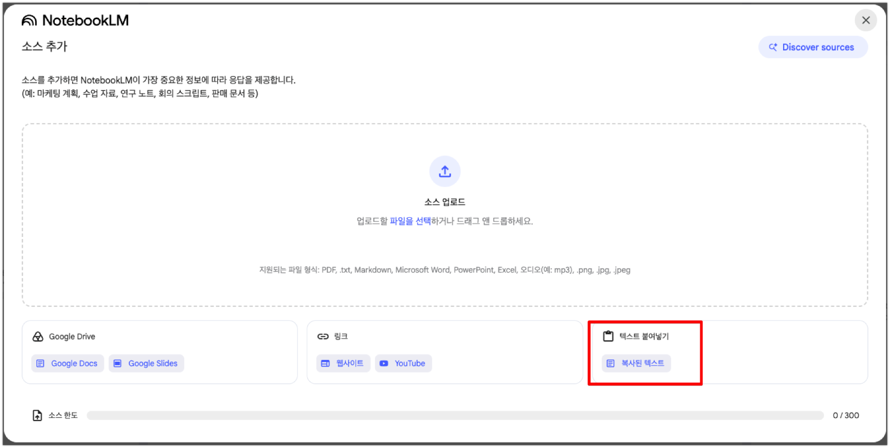

3. 아래 3가지 신사업 기획 초안을 **각각 개별 소스로 붙여넣기**합니다.

   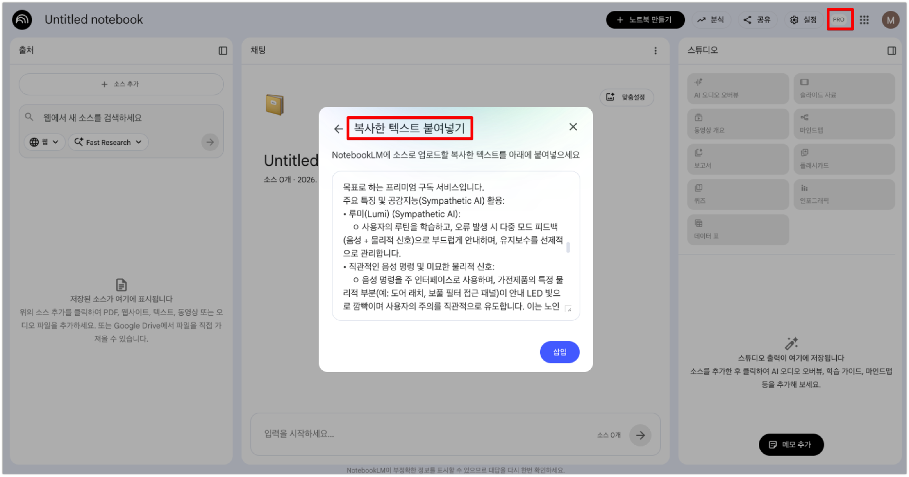

   **[소스 A] LG "안심" 홈 가디언 에코시스템**
   ```
   # LG "안심" 홈 가디언 에코시스템 (LG "Ahn Shim" Home Guardian Ecosystem) 아이디어 개요:
   LG "안심" 홈 가디언은 80세 이상의 비기술 친화적 노인들이 독립적으로 생활하면서 깊은 평온함과 힘을 얻을 수 있도록 설계된 혁신적인 공감 서비스 생태계입니다. LG의 IoT 플랫폼과 '공감지능(Sympathetic AI)'(아우라 허브, 컴포트 컨시어지 음성, 위즈덤 AI 엔진 포함)을 활용하여 스마트 가전제품을 사전에 모니터링합니다.
   "안심"은 모호한 오류 대신 잠재적인 문제를 부드럽게 소통하고, 유도된 간단한 작업부터 원활한 화이트 글러브(White-Glove) 전문 개입까지 개인화되고 노력이 필요 없는 해결 옵션을 제공하여, 가전제품 관리의 불안감을 완전히 해소하고 정서적 웰빙을 증진시킵니다.

   * 상세 설명 검토 요약: 이 서비스는 80세 이상의 비기술 친화적 노인들이 겪는 모호한 가전제품 오류 코드, 예상치 못한 동작(낯선 소리, 성능 변화) 해석 및 유지보수/수리 관리의 어려움으로 인한 만연한 불안감, 혼란, 독립성 저하라는 핵심 불편함을 해결하고자 합니다. 이는 디지털 리터러시 부족, 물리적 매뉴얼 접근의 어려움, 추가 손상에 대한 두려움으로 인해 스트레스, 타인 의존, 자가 관리 능력에 대한 자신감 저하로 이어집니다. "안심" 생태계는 "인지적 부담 제로, 정서적 고양감 극대화" 원칙을 중심으로 설계되었습니다.

   * 주요 구성 요소:
   • LG "안심" 아우라 허브 (Aura Hub): 집의 중앙 인터페이스로, 미묘한 주변 조명('아우라'로 비언어적 신호 제공), 시력 저하 노인을 위한 대형 고대비 아이콘 기반 디스플레이, 고음질 스피커, 그리고 단일 촉각 버튼을 갖추고 Sympathetic AI의 주요 통신 지점 역할을 합니다.
   • "컴포트 컨시어지" 음성 모델 (Comfort Concierge Voice Model): 공감적인 어조, 측정된 속도, 간단한 어휘, 명확한 발음으로 훈련된 Sympathetic AI 음성 페르소나입니다. 노인의 인지 부하를 줄이고 신뢰를 구축하며 평온함을 유도하도록 설계되어, 설명, 선택, 지침 및 안심을 전달합니다.
   • "위즈덤 AI 엔진" (Wisdom AI Engine): "안심" 생태계의 핵심 학습 및 개인화 엔진으로, 사용자의 루틴, 선호도, 환경 조건, 심지어 생리적 상태까지 간접적으로 학습합니다. 초개인화된 제안, 통신 스타일 조정, 개입 임계값을 학습하며, 데이터 프라이버시, 동의, 의존성 또는 조작 방지를 위한 윤리적 가드레일을 포함합니다.
   • LG ThinQ Care 플랫폼 및 스마트 진단 통합: 연결된 LG 스마트 가전제품의 실시간 진단 데이터, 예측 분석, 원격 제어 기능을 제공하는 기반 IoT 인프라입니다.
   • LG "안심" 화이트 글러브 서비스 네트워크: 노인 민감성 및 공감적 의사소통에 특화된 LG 현장 기술자 및 고객 지원 네트워크입니다. AI가 모든 것을 관리하여 노인의 행정적 부담을 완전히 제거하고 원활한 물리적 개입을 제공합니다.

   * Sympathetic AI를 통한 경험 재설계:
   • 예방적 파수꾼 및 "젠틀 아우라 넛지": ThinQ Care와 Wisdom AI Engine이 가전제품의 미묘한 이상을 감지하면, Aura Hub가 부드러운 비언어적 신호(예: 주변 조명 변경, 간단한 애니메이션 아이콘)를 보내 문제가 발생하기 전에 불안감을 예방합니다.
   • 공감적 "컴포트 컨시어지" 대화: AI는 노인의 잠재적 혼란이나 걱정을 인정하고, 비기술적이고 간단한 언어로 문제를 설명하여 평온함과 신뢰를 구축합니다.
   • 개인화된, 노력 제로 해결 경로: AI는 노인의 신체적, 인지적 능력 및 선호도를 이해하여 안내된 자가 유지보수 또는 AI가 모든 것을 관리하는 원활한 전문 개입 옵션을 제공하여 존엄성과 자율성을 보존합니다.
   • 전체적인 홈 웰빙 및 선제적 "위즈덤 AI": 문제 해결을 넘어, AI는 환경 데이터 및 가전제품 사용 패턴을 지속적으로 관찰하여 노인의 편안함과 루틴을 지원합니다.
   ```

   **[소스 B] LG '루미케어' - 공감하는 세탁 도우미**
   ```
   # LG '루미케어' - 공감하는 세탁 도우미 (LG 'LumiCare' - The Empathetic Laundry Steward) 아이디어 개요:
   LG '루미케어'는 80세 이상의 비기술 친화적 노인들을 위한 프리미엄, 프라이버시 인증 구독 서비스입니다. 복잡한 현대 세탁기로 인해 겪는 좌절감과 존엄성 상실을 해결하고, LG 세탁기를 공감하는 "세탁 관리자"로 변모시킵니다. 직관적인 음성 명령, 미묘한 물리적 신호, 그리고 개인화된 온보딩 과정을 통해 적응적이고 동의 기반의 지원을 제공합니다. Sympathetic AI인 "루미(Lumi)"는 사용자 루틴을 학습하고, 오류 발생 시 다중 모드 피드백으로 부드럽게 안내하며, 유지보수를 선제적으로 관리하고, 명시적인 사용자 동의 하에 가족을 위한 "웰빙 대시보드"를 제공합니다. 이 서비스는 노인의 능력 회복, 불안 감소, 존엄성 증진을 목표로 합니다.

   * 주요 특징 및 공감지능(Sympathetic AI) 활용:
   • 루미(Lumi) (Sympathetic AI): 사용자의 루틴을 학습하고, 오류 발생 시 다중 모드 피드백(음성 + 물리적 신호)으로 부드럽게 안내하며, 유지보수를 선제적으로 관리합니다.
   • 직관적인 음성 명령 및 미묘한 물리적 신호: 음성 명령을 주 인터페이스로 사용하며, 가전제품의 특정 물리적 부분(예: 도어 래치, 보풀 필터 접근 패널)이 안내 LED 빛으로 깜빡이며 사용자의 주의를 직관적으로 유도합니다.
   • 지원된 자율성(Assisted Autonomy): 루미는 항상 "초대 또는 부드러운 제안"으로 안내하며, "지시 또는 명령"이 아님으로써 노인의 존엄성과 주체성을 보존합니다.
   • 동의 기반의 최적 이하 선택 방향 전환: 사용자가 최적이 아닌 설정을 선택할 경우, 루미는 "존중과 함께 알리고 제안"하고, 사용자가 고집할 경우 명시적인 구두 동의와 기록 허가를 받아 진행하여 사용자에게 궁극적인 통제권을 부여합니다.
   • 루미케어 공감 컨시어지 (Sympathetic Concierge): LG 전문가들이 노인의 집을 방문하여 루미의 '성격'을 맞춤 설정하고 루틴을 이해하는 화이트 글러브 온보딩 과정으로, 초기 신뢰 구축에 매우 중요합니다.
   • 프라이버시 인증 구독 서비스: 엄격한 프라이버시 기준을 준수하며, 시각적 콘텐츠나 주변 오디오/비디오 감시를 사용하지 않음을 명시합니다.
   ```

   **[소스 C] LG 센티넬 컴패니언 – 공감하는 생명선**
   ```
   # LG 센티넬 컴패니언 – 공감하는 생명선 (LG Sentinel Companion – Empathetic Lifeline for Emergency Assistance) 아이디어 개요:
   LG 센티넬 컴패니언은 독립적으로 생활하는 80세 이상의 비기술 친화적 노인들을 위한 혁신적인 AI 기반 공감 비상 지원 서비스입니다. 위기 상황(낙상, 의료 사고, 불안감 등) 발생 시 즉각적이고 신뢰할 수 있는 도움을 요청하기 어려운 문제를 해결합니다. LG 스마트 홈 생태계 전반에 걸쳐 원활하게 통합되어, 스마트 가전제품이나 음성 명령을 통해 손쉽게 활성화됩니다. 활성화 시, 차분한 "공감지능(Sympathetic AI)"에 즉시 연결되어 중요한 정보를 부드럽게 수집하는 동시에 가족과 응급 서비스에 알림을 보냅니다.

   * 주요 특징 및 공감지능(Sympathetic AI) 활용:
   • LG 스마트 홈 생태계 전반에 걸친 원활한 통합: LG 스마트 가전제품(냉장고, 스마트 스피커 등)을 통해 작동하여, 집안 어디에서든 도움을 받을 수 있도록 합니다.
   • 손쉬운 활성화: 가전제품의 물리적 SOS 버튼 또는 범용 음성 명령을 통해 노인들이 위기 상황에서 쉽게 서비스를 활성화할 수 있도록 합니다.
   • 지속적인, 공감하는 생명선: Sympathetic AI는 절대 끊기지 않고 인간 지원이 도착할 때까지 지속적인 안심과 정서적 지원을 제공합니다.
   • 차분한 Sympathetic AI 상호작용: 위기 상황에서 차분하고 안심시키는 음성으로 노인과 대화하며 정보를 수집하고, 도움 진행 상황에 대한 정기적인 업데이트를 제공합니다.
   • 다단계 알림: 사전에 승인된 가족/간병인 및 응급 서비스(911/상응하는 기관)에 동시에 알림을 발송합니다.
   • 프라이버시 및 보안: 민감한 의료 데이터 저장 및 지속적인 AI "청취"와 관련된 프라이버시 및 보안 문제에 대한 강력한 암호화, 투명한 정책, 규제 준수를 강조합니다.
   • 수동 모니터링 통합: 비침해적인 수동 모니터링(예: 낙상 감지, 비정상적인 소리)을 통합하여 노인이 직접 활성화할 수 없는 상황에서도 선제적으로 비상 상황을 감지하고 도움 요청 프로토콜을 시작할 수 있습니다.
   ```

   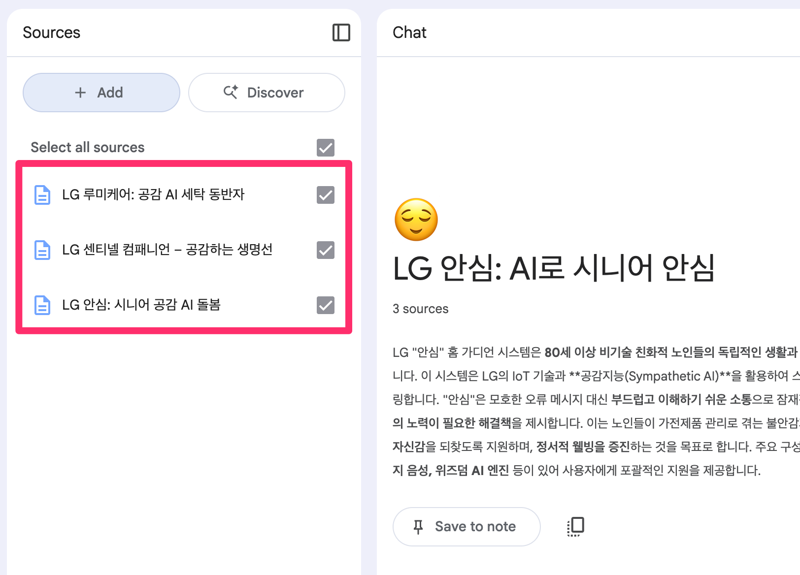

   NotebookLM은 입력한 소스를 기반으로 질문하고 답변을 받을 수 있습니다.
   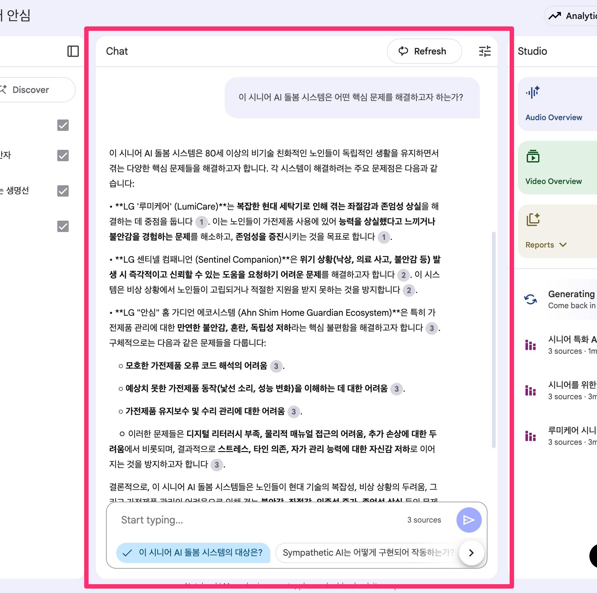

1. **기본 인포그래픽**: 우측에 Infograpgic 버튼의 점 세 개 메뉴를 클릭합니다.
   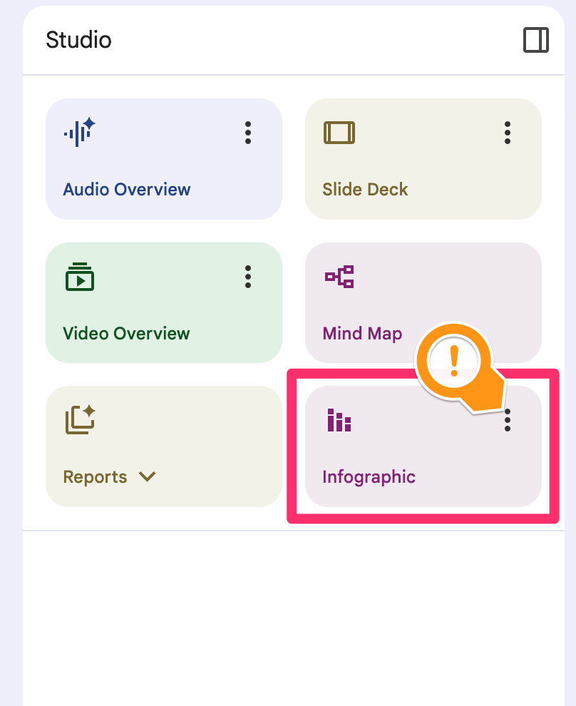

    그 후 아래 프롬프트를 입력합니다.
   ```
   LG '루미케어' 공감하는 세탁 도우미 서비스의 핵심 가치와 노인 사용자 기대 효과를 한눈에 보여주는 인포그래픽을 생성해줘
   ```

   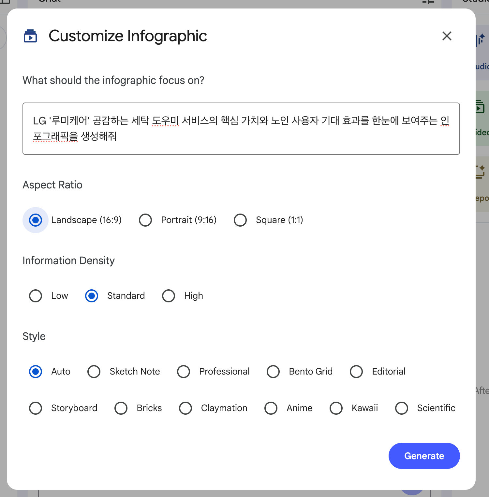
   

   > [!TIP]
   > **화면 비율 안내**: 인포그래픽이 세로로 길게 보일 수 있습니다. **다운로드** 버튼으로 저장하면 16:9 가로 비율로 정상 출력됩니다.

2. **스케치노트 스타일**: 동일한 Infographic 생성 버튼을 눌러서 다른 프롬프트를 입력해봅니다.
   ```
   LG '안심' 홈 가디언 에코시스템의 주요 구성 요소와 시니어 케어 작동 시나리오를 스케치노트(sketch-note) 스타일로 시각화해줘
   ```
   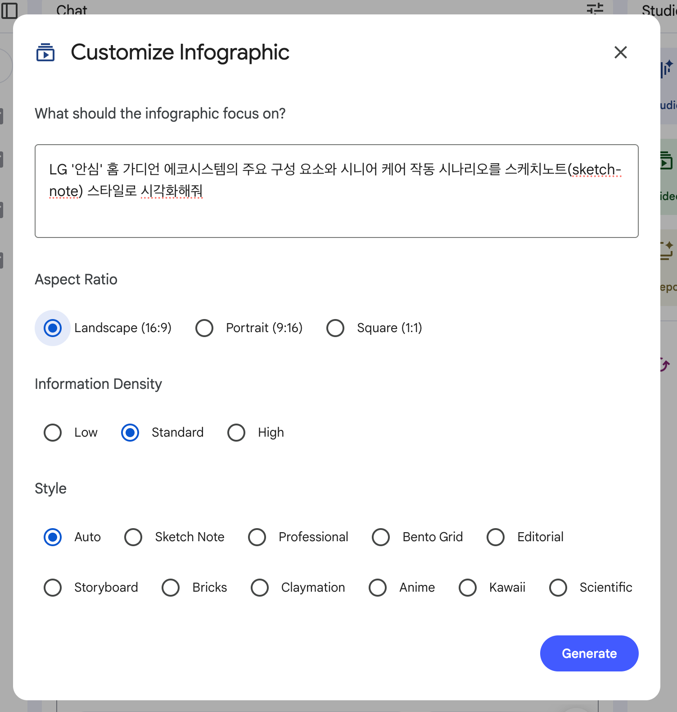

   

3. **신문 1면 스타일**: 동일 소스에서 퍼블리싱 톤의 결과물을 뽑아봅니다.
   ```
   LG '센티넬 컴패니언' AI 기반 노인 비상 지원 서비스 출시 소식을 신문 1면 기사 인포그래픽 스타일로 만들어줘
   ```
   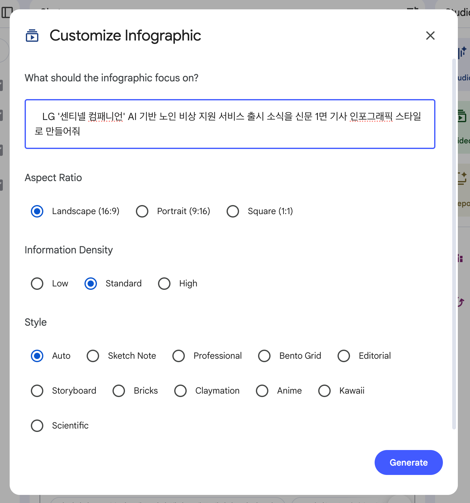
   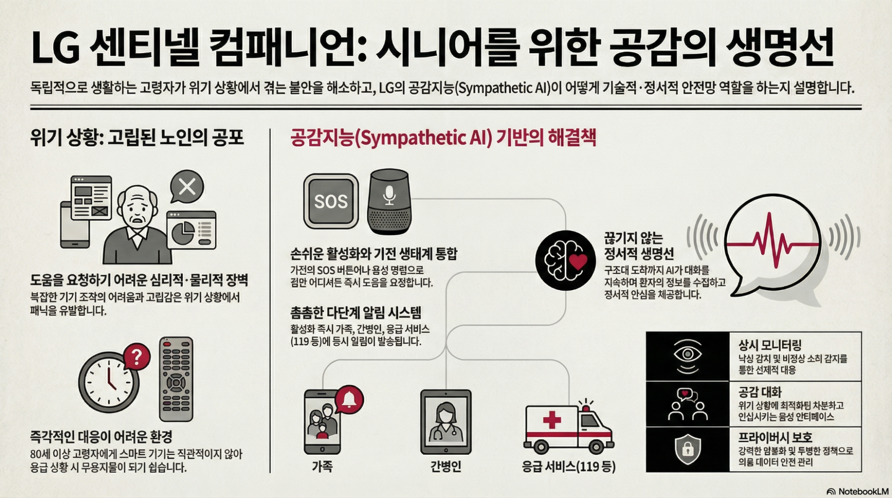

---

### 🎙️ 실습 2: Audio Overview — AI 팟캐스트 자동 생성

NotebookLM의 킬러 기능 중 하나입니다. 동일 노트북 우측 **오디오 개요** 패널에서 **생성하기**를 클릭하면, AI 진행자 2인이 소스 문서 전체를 요약해 **5~8분 분량의 팟캐스트 오디오**를 자동 완성합니다.

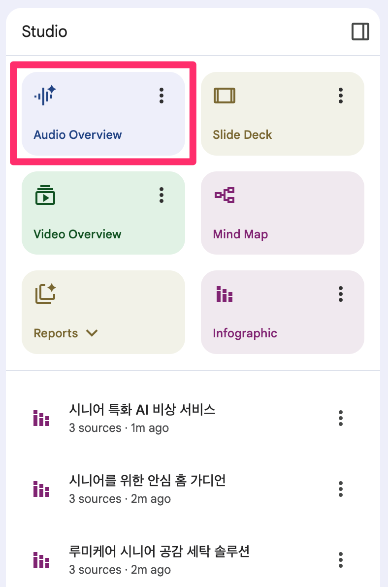

오디오 생성은 소요시간이 꽤 걸리므로 다른 작업을 진행 후 이후에 확인해봅니다.

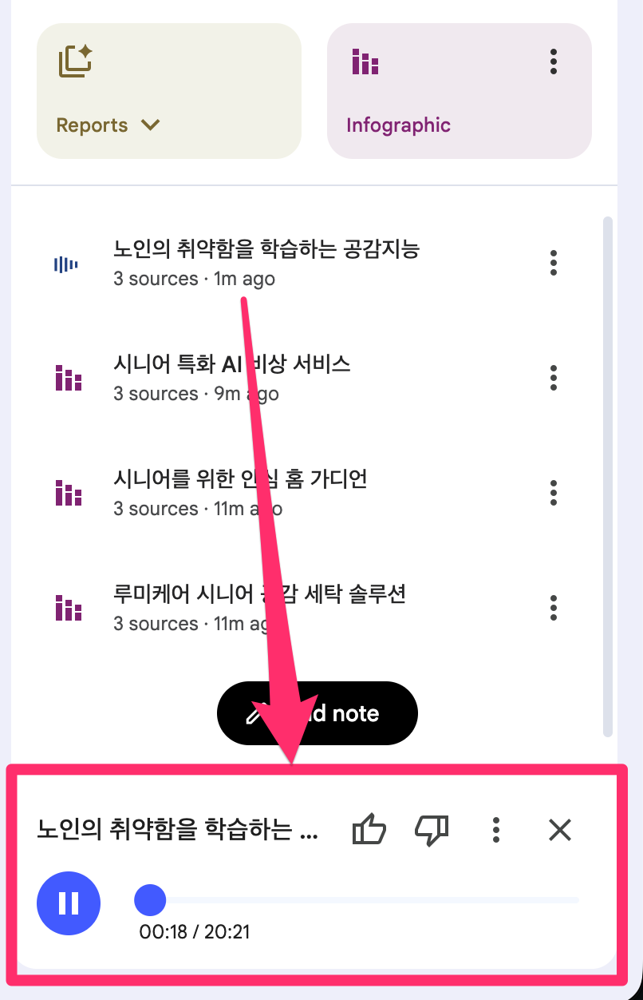

생성된 오디오 결과물을 직접 들어볼 수 있습니다.

- [🎙️ notebooklm_audio.wav](./samples/notebooklm_audio.wav)

> [!TIP]
> 팀 내 공유용으로 사용하거나, 이동 중 이어폰으로 문서 내용을 파악할 때 매우 유용합니다. 생성된 오디오는 다운로드 후 사내 메신저나 이메일로 바로 배포할 수 있습니다.

---

### 🎬 실습 3: Slide Deck — 시네마틱 슬라이드 생성

텍스트 없이 **제품 이미지만으로** NotebookLM이 영화 같은 시네마틱 슬라이드를 자동 생성합니다. 라이프스타일 브랜드 '홈스타일'의 신제품 이미지를 소스로 업로드하고, 짧은 브랜드 스토리를 붙여 시네마틱 슬라이드를 만들어봅니다.

#### 1단계: 실습 파일 다운로드 및 압축 해제

아래 버튼을 클릭해 실습용 이미지가 포함된 압축파일 homestyle.zip을 로컬에 저장합니다.

<a href="./samples/homestyle.zip" download style="display:inline-flex;align-items:center;gap:6px;background:#1a73e8;color:#fff;padding:8px 18px;border-radius:6px;text-decoration:none;font-weight:500">📥 homestyle.zip 받기</a>

다운로드 후 압축을 해제하면 `sofa.png`, `cushion.png`, `lighting.png`, `diffuser.png` 4장의 제품 이미지가 나옵니다.

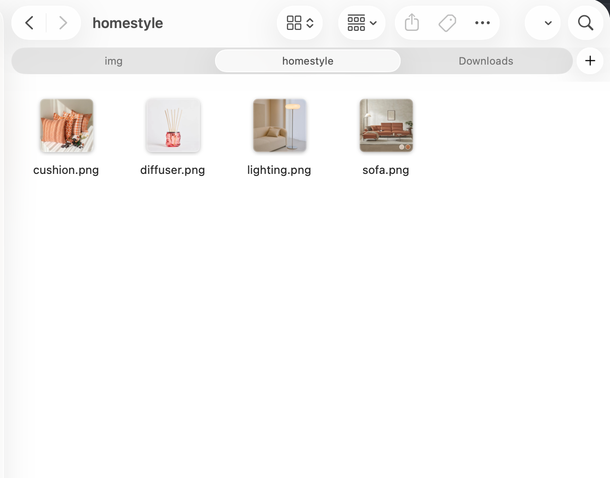

#### 2단계: 새 노트북 생성 및 이미지 소스 추가

1. [NotebookLM 홈](https://notebooklm.google/)에서 **새로만들기**를 클릭해 새 노트북을 엽니다.
2. **소스 추가** → **파일 업로드**를 선택하고 압축 해제된 이미지 4장(`sofa.png`, `cushion.png`, `lighting.png`, `diffuser.png`)을 **한꺼번에** 선택해 업로드합니다.

   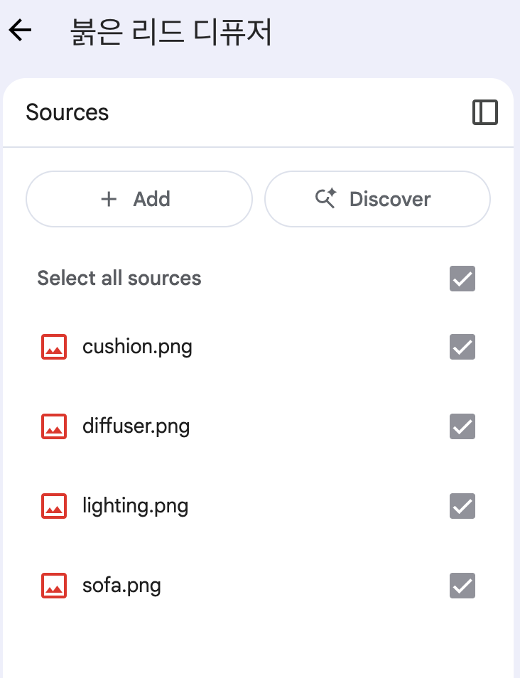

#### 3단계: 브랜드 스토리 텍스트 추가

**소스 추가** → **텍스트 붙여넣기**를 선택하고, 아래 텍스트를 복사해 붙여넣기한 뒤 소스 이름을 **story** 로 저장합니다.

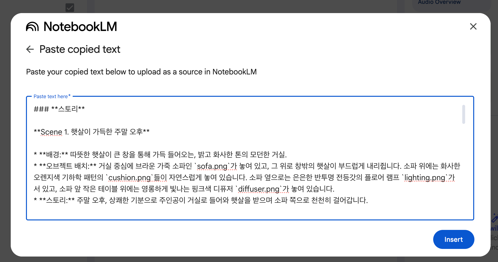

```markdown
### **스토리**

**Scene 1. 햇살이 가득한 주말 오후**

* **배경:** 따뜻한 햇살이 큰 창을 통해 가득 들어오는, 밝고 화사한 톤의 모던한 거실.
* **오브젝트 배치:** 거실 중심에 브라운 가죽 소파인 `sofa.png`가 놓여 있고, 그 위로 창밖의 햇살이 부드럽게 내리쥡니다. 소파 위에는 화사한 오렌지색 기하학 패턴의 `cushion.png`들이 자연스럽게 놓여 있습니다. 소파 옆으로는 은은한 반투명 전등갓의 플로어 램프 `lighting.png`가 서 있고, 소파 앞 작은 테이블 위에는 영롱하게 빛나는 핑크색 디퓨저 `diffuser.png`가 놓여 있습니다.
* **스토리:** 주말 오후, 상쾌한 기분으로 주인공이 거실로 들어와 햇살을 받으며 소파 쪽으로 천천히 걸어갑니다.

**Scene 2. 포근한 소파에서의 시작 (`sofa.png`)**

* **배경:** 햇살이 가득 찬 화사한 거실.
* **오브젝트 배치:** 주인공이 햇살을 가득 머금은 **`sofa.png`** 브라운 가죽 소파에 몸을 포근하게 맡깁니다. 소파의 넓고 유연한 가죽 질감이 소파를 중심으로 거실 공간 전체와 자연스럽게 어우러져 화면에 담깁니다.
* **스토리:** 주인공이 소파에 기대어 편안한 표정으로 숨을 고릅니다. 소파는 거실의 중심에서 가장 따뜻하고 포근한 안식처의 역할을 합니다.

**Scene 3. 온기를 더하는 화사한 포인트 (`cushion.png`)**

* **배경:** 소파와 그 주변 가구들이 함께 보이는 거실 전경.
* **오브젝트 배치:** 주인공이 앉은 자리 옆, **`sofa.png`** 위에 놓인 **`cushion.png`** 오렌지색 기하학 패턴 쿠션들이 선명하게 보입니다. 쿠션은 햇살 아래에서 한층 더 화사하고 생기 있게 빛납니다.
* **스토리:** 주인공이 자연스럽게 옆에 있던 오렌지색 쿠션 하나를 품에 끌어안습니다. 선명한 패턴과 색감이 거실 분위기를 한층 더 감각적이고 상쾌하게 변화시킵니다.

**Scene 4. 공간을 채우는 부드러운 빛 (`lighting.png`)**

* **배경:** 턴을 넘기듯 자연스럽게 이어지는 거실 공간.
* **오브젝트 배치:** 주인공이 소파에 앉은 채로 손을 뻗어, 소파 옆에 자연스럽게 배치된 **`lighting.png`** 플로어 램프를 켭니다. 은은하고 부드러운 유백색 빛이 자연 채광과 섞여 거실 전체를 한층 더 아늑하게 감싸 안습니다.
* **스토리:** 조명의 따스한 불빛이 들어오면서 공간의 입체감이 살아나고, 거실 전체 인테리어가 더욱 세련되고 완성도 높게 연출됩니다.

**Scene 5. 감각을 깨우는 상쾌한 향기 (`diffuser.png`)**

* **배경:** 소파 앞 테이블과 거실 전체가 흐릿하게(아웃포커싱) 잡히는 구도.
* **오브젝트 배치:** 카메라 시선이 소파 앞 테이블 위에 놓인 **`diffuser.png`** 핑크색 디퓨저를 향합니다. 디퓨저는 햇살과 램프 빛을 동시에 받아 영롱하게 반짝이며 공간의 오브젝트들과 완벽한 톤앤매너를 이룹니다.
* **스토리:** 공기 중으로 디퓨저의 상쾌한 향이 은은하게 퍼지는 듯한 연출과 함께, 쿠션을 안고 소파에 기댄 주인공이 편안하게 눈을 감으며 주말의 완벽한 휴식을 만끽합니다.

**Scene 6. 완벽한 휴식의 공간 (엔딩)**

* **배경:** 모든 아이템이 조화롭게 어우러진 전체 거실 전경.
* **오브젝트 배치:** 카메라가 천천히 뒤로 물러나며(줌아웃), **`sofa.png`** 소파 위에 **`cushion.png`** 쿠션을 안고 햇살을 받으며 누운 주인공, 그 옆을 따뜻하게 비추는 **`lighting.png`** 램프와 상쾌한 무드를 더하는 `diffuser.png`까지 완벽하게 어우러진 화사한 거실의 전체 인테리어를 잡습니다.
* **스토리:** 잘 정돈된 아름다운 공간 속에서 오감으로 완성된 나만의 안식처를 보여주며 상쾌하게 마무리됩니다.
```


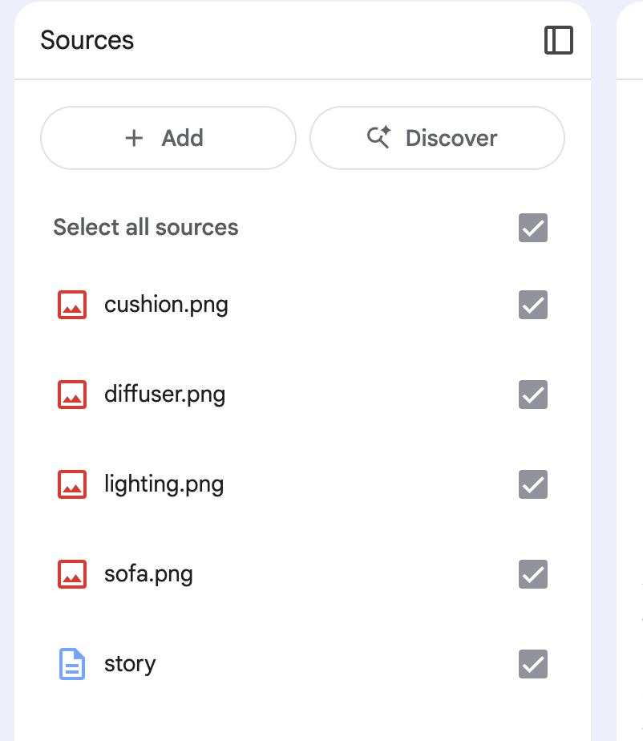

#### 4단계: 시네마틱 슬라이드 생성

소스가 모두 준비되면, 노트북 우측 **슬라이드 자료** 패널에서 customize 옵션을 선택합니다.

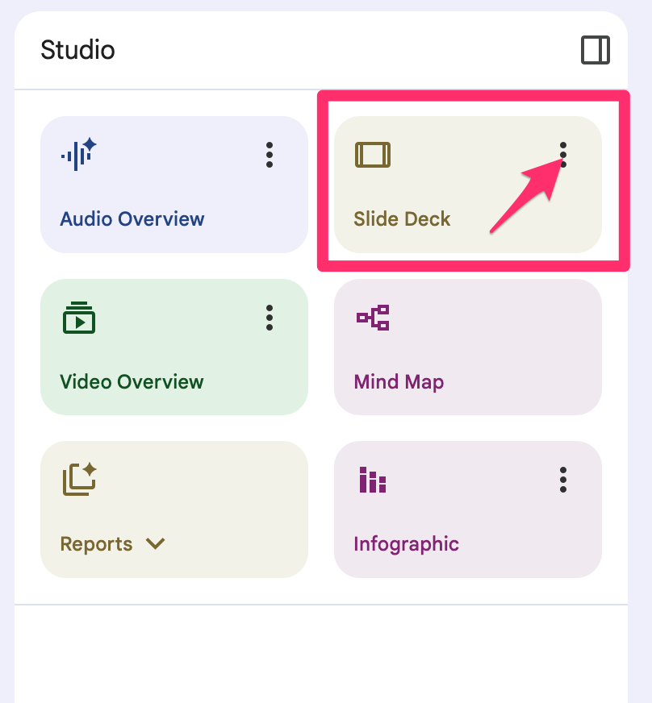

아래 프롬프트를 복사하여 붙여넣습니다.

```markdown
스토리에 맞는 시네마틱 슬라이드를 만들어줘, 타이틀, 텍스트, 자막, 설명 등은 포함하지 마
```

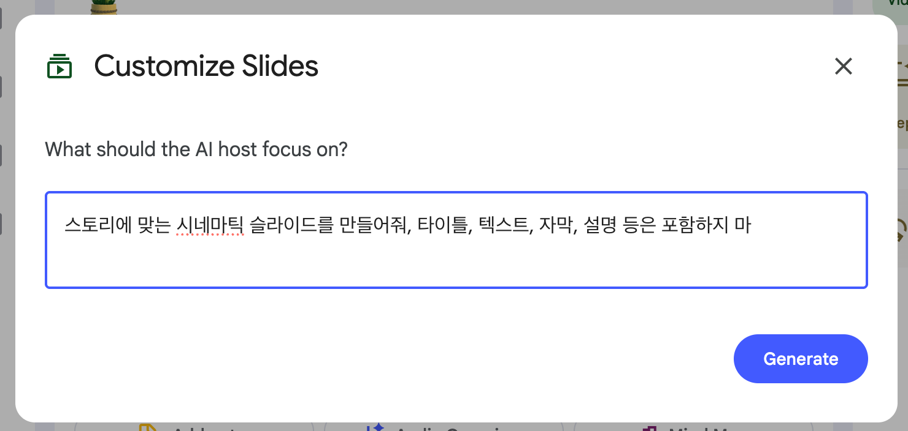

생성되는데 시간이 소요가 됩니다.

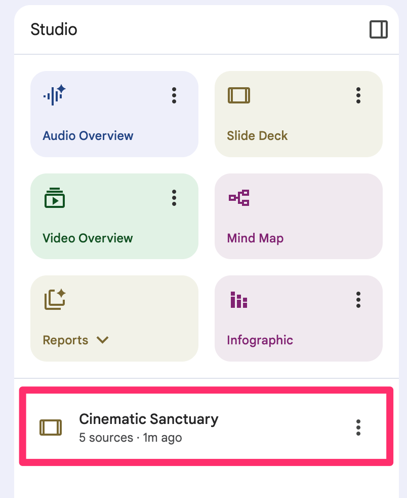

완성된 슬라이드를 볼 수 있습니다.

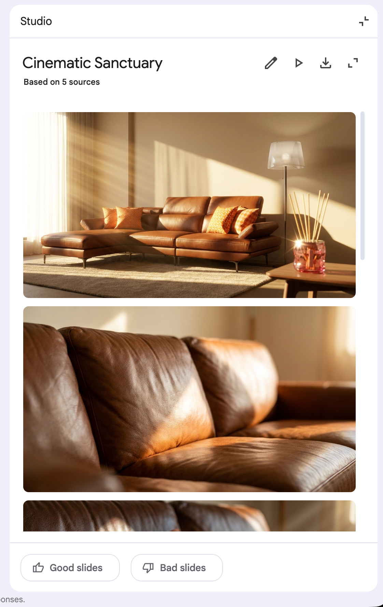

다운로드도 할 수 있습니다.

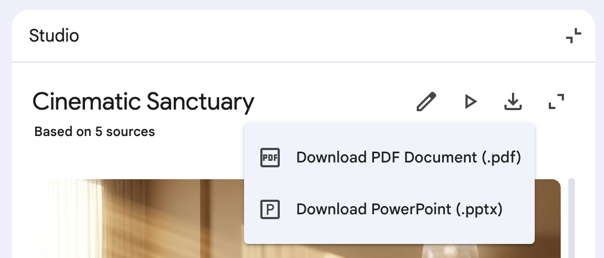

pptx 파일로 다운로드하였습니다.

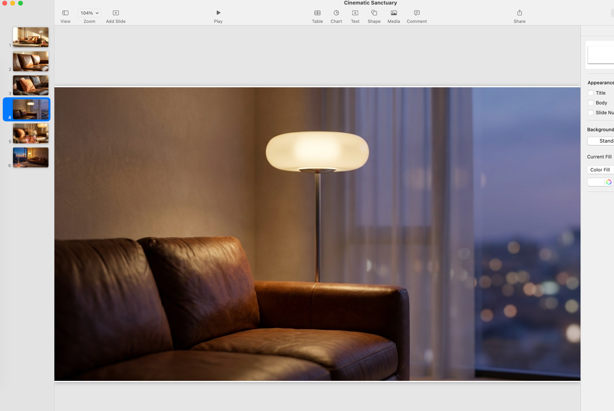

결과물은 직접 보실 수 있습니다.

- [📊 Cinematic Sanctuary.pptx](./samples/Cinematic%20Sanctuary.pptx)
- [📄 Cinematic Sanctuary.pdf](./samples/Cinematic%20Sanctuary.pdf)


> [!TIP]
> 시네마틱 슬라이드는 이미지 소스가 있어야 생성됩니다. 텍스트만 있을 경우 일반 슬라이드 자료로 안내될 수 있습니다. 이미지 품질이 높을수록 결과물의 완성도도 높아집니다.

---

### 📖 실습 4: Slide Deck + Reports — 설명서 만들기

새로운 노트북을 하나 생성합니다. 상단 다운로드 카드에서 받은 `data_agent.zip`을 로컬에서 압축 해제한 뒤, 파일 업로드로 이미지 10개를 소스에 추가합니다. **슬라이드 Customize**로 가이드 문서를 생성하고, Studio의 **Reports** 기능으로 스터디 가이드·FAQ·브리핑 문서를 차례로 만들어봅니다.

**생성 방법:**

1. [NotebookLM 홈](https://notebooklm.google/)에서 **새로만들기**를 클릭합니다. **소스 추가** → **파일 업로드**를 선택한 뒤, 상단에서 다운로드한 `data_agent.zip`의 압축을 해제하고 이미지 10개를 소스에 추가합니다.

   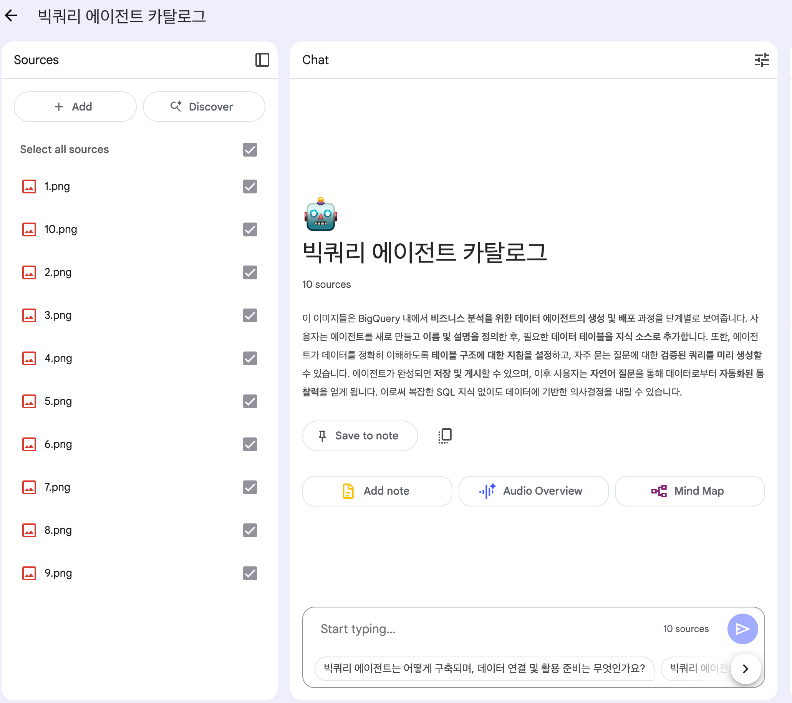

2. 우측 **Studio** 패널에서 **슬라이드** 의 Customize 버튼을 클릭합니다.

   

3. 그 후 아래 텍스트를 복사하여 붙여넣습니다.
   ```
   BigQuery Data Agent를 생성하는 과정을 초보자도 쉽게 따라할 수 있도록 가이드 문서를 작성해줘
   ```

   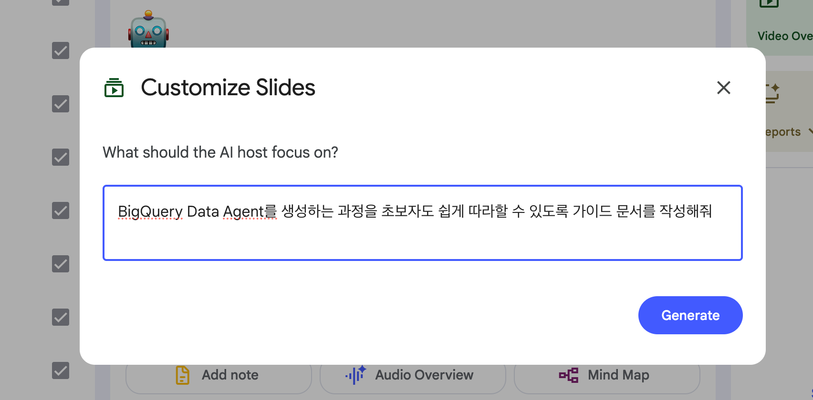

4. 완성되면 다음과 같이 출력이 되게 됩니다.

   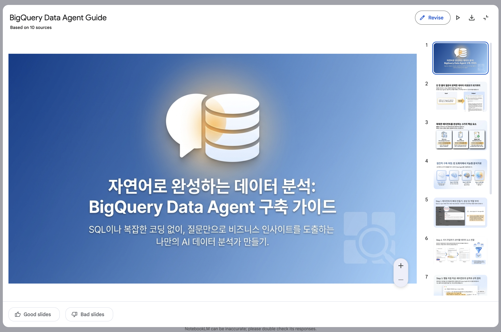
   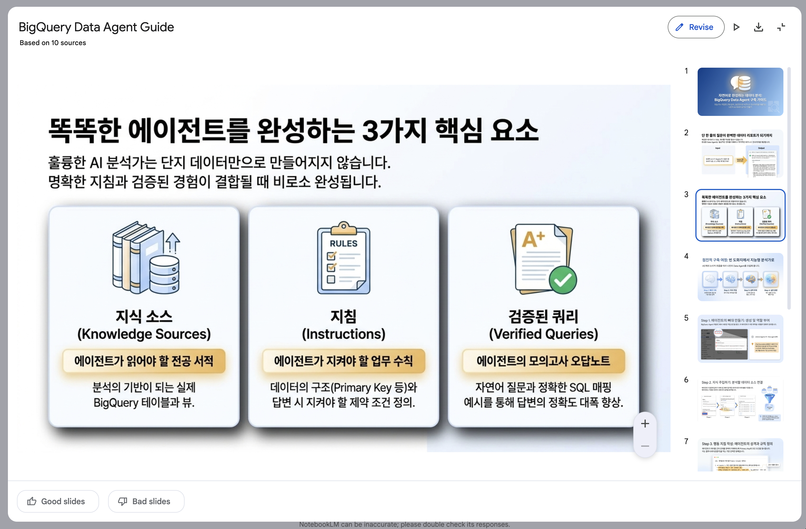

5. Studio 섹션에서 Reports 에서 Study guide, FAQ, Briefing doc을 차례대로 클릭해봅니다.
   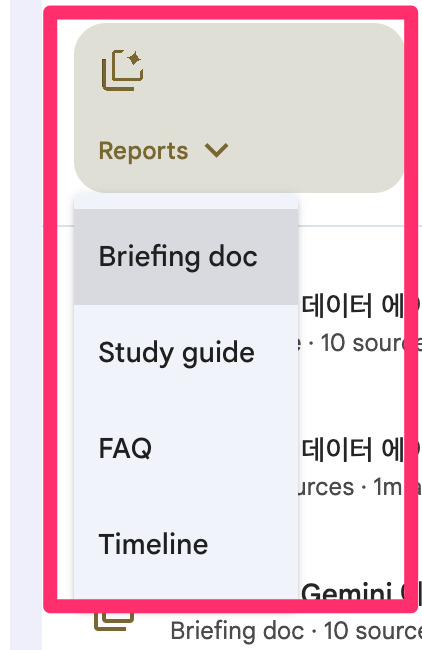

6. Study guide는 아래와 같은 내용으로 생성되었습니다.
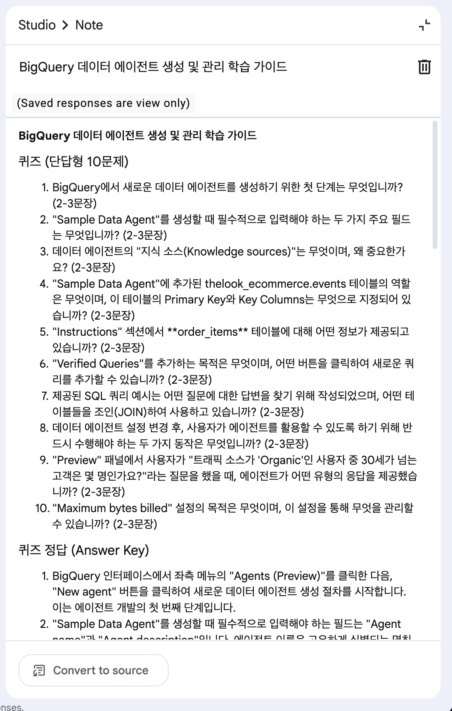

7. FAQ는 아래와 같은 내용으로 생성되었습니다.
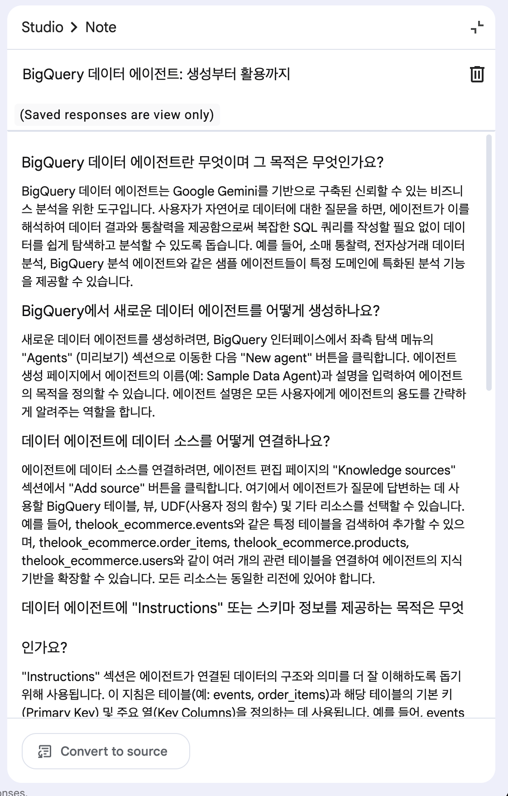

8. Briefing doc는 아래와 같은 내용으로 생성되었습니다.
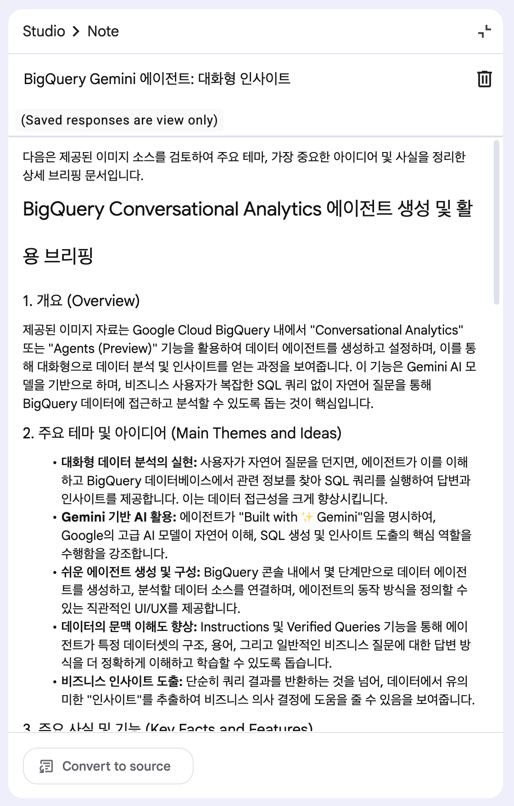

> [!TIP]
> 스터디 가이드는 기술 개념 학습용으로, FAQ는 팀 온보딩 자료로, 브리핑 문서는 임원 보고서로 바로 활용할 수 있습니다.

---

### 🎬 실습 5: Video Overview — 동영상 만들기

**Gemini Enterprise Canvas** 기능 사용법을 설명하는 튜토리얼 동영상을 NotebookLM이 자동 생성합니다. PDF 문서와 스크린샷 이미지를 소스로 제공하면, 별도 편집 도구 없이 단계별 설명 영상이 완성됩니다.

#### 1단계: 실습 파일 준비

아래 버튼을 클릭해 실습 파일 2종을 로컬에 저장합니다.

<a href="./samples/canvas.pdf" download style="display:inline-flex;align-items:center;gap:6px;background:#1a73e8;color:#fff;padding:8px 18px;border-radius:6px;text-decoration:none;font-weight:500;margin-right:8px">📥 canvas.pdf 받기</a>
<a href="./samples/canvas.zip" download style="display:inline-flex;align-items:center;gap:6px;background:#1a73e8;color:#fff;padding:8px 18px;border-radius:6px;text-decoration:none;font-weight:500">📥 canvas.zip 받기</a>

- `canvas.pdf` — Canvas 기능 소개 및 사용 가이드 문서
- `canvas.zip` — Canvas UI 스크린샷 이미지 모음 (압축 해제 후 사용)

#### 2단계: 새 노트북 생성 및 소스 추가

1. [NotebookLM 홈](https://notebooklm.google/)에서 **새로만들기**를 클릭합니다.
2. **소스 추가** → **파일 업로드**에서 `canvas.pdf`를 추가합니다.
3. `canvas.zip` 압축을 해제한 뒤, 이미지 파일 전체를 한꺼번에 소스로 업로드합니다.

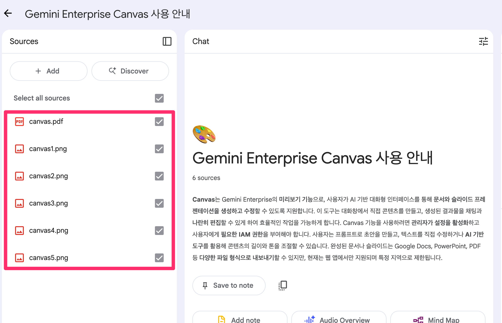

#### 3단계: 동영상 생성 프롬프트 입력

소스 업로드가 완료되면 Video Overview의 Customize 버튼을 클릭합니다.

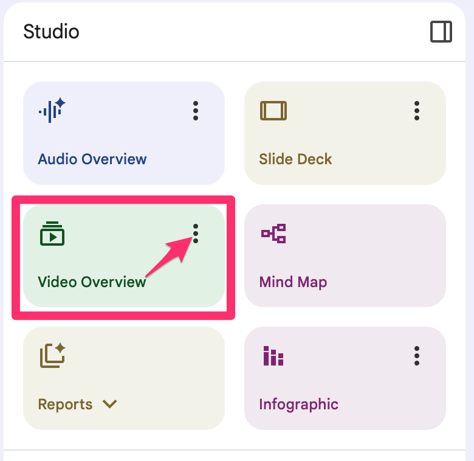

```markdown
Gemini Enterprise에서 Canvas를 사용하는 방법을 초보자도 따라가기 쉽게 차근차근 설명하는 동영상을 만들어줘
```

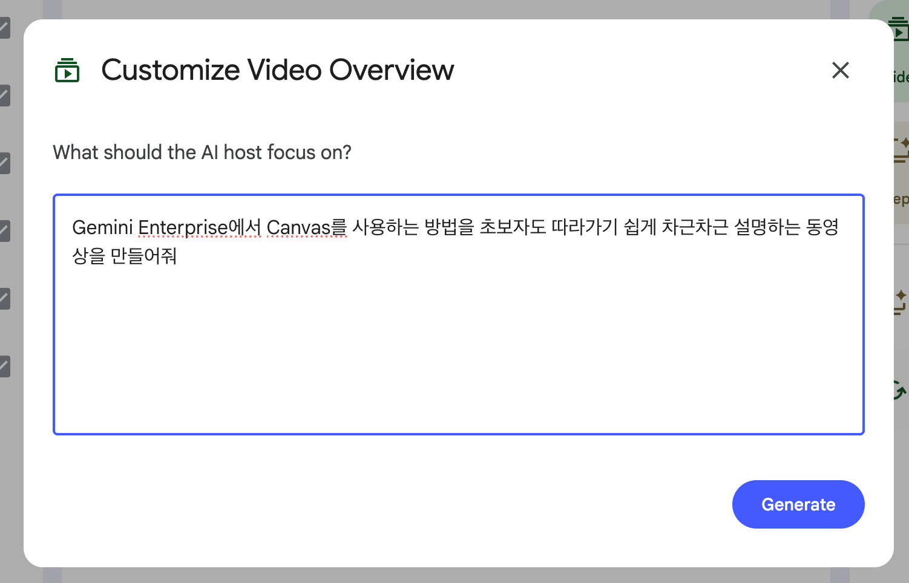

잠시 후 Canvas 기능 소개 튜토리얼 영상이 자동 완성됩니다.

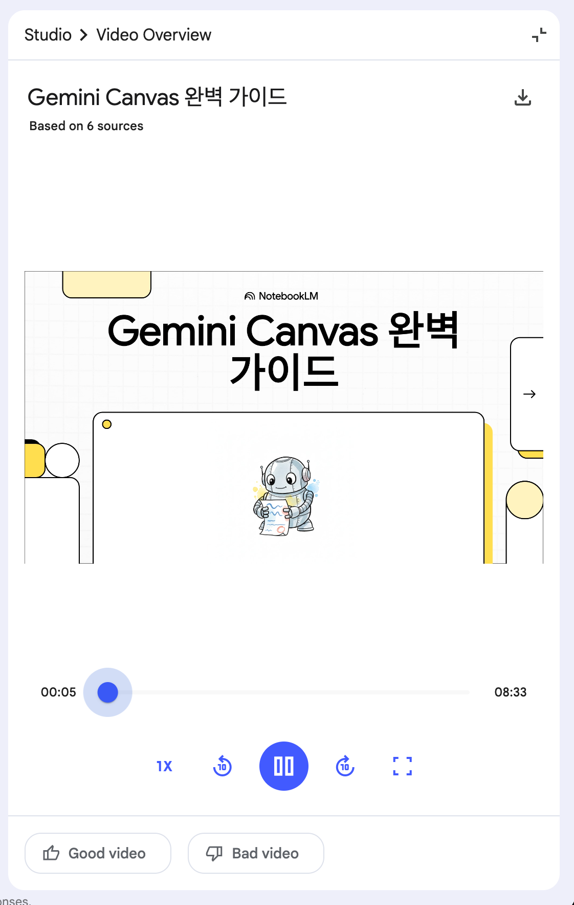
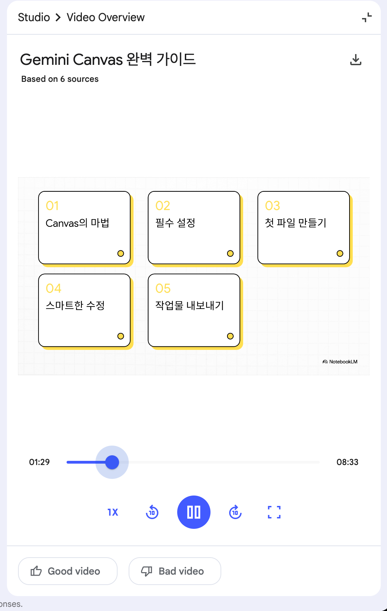
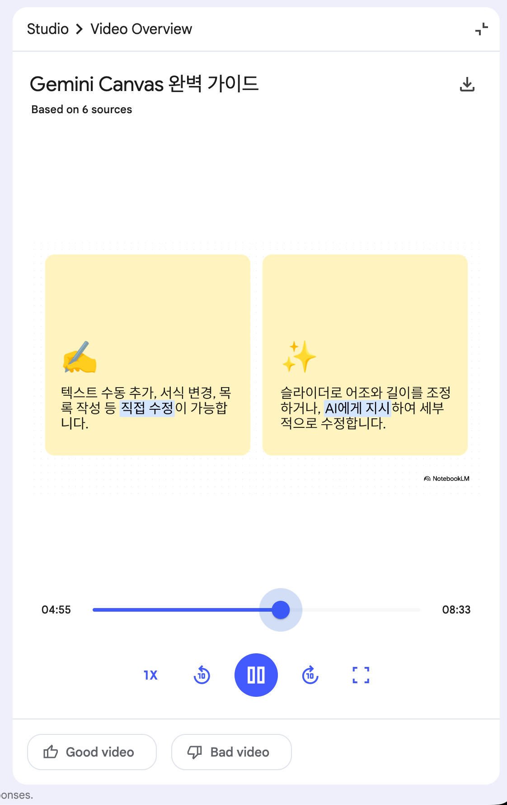

> [!NOTE]
> 참고 영상: [YouTube — Gemini Enterprise Canvas 데모](https://www.youtube.com/watch?v=4-5qeh4IXVY)
> 동영상 생성 기능은 NotebookLM의 소스 내용을 기반으로 하므로, 소스 품질이 높을수록 더 정확한 튜토리얼 영상이 만들어집니다.

## 2.4. 자율형 심층 조사 및 아이디어 연쇄 생성

주제 하나만 주면, 수백 개의 웹 소스를 스스로 탐색해 목차 있는 보고서를 만들어 줍니다. Idea Generation 에이전트로 비즈니스 아이디어도 연쇄 생성해봅니다.

- **실습 진입**: 화면 좌측 또는 하단 메뉴에서 **Deep Research** 아이콘을 클릭합니다.

  

- **리서치 프롬프트 복사 및 실행**:
  대화창에 아래 프롬프트를 입력하여 실습을 진행합니다.
  ```markdown
  현재 글로벌 스마트 오피스 IoT 및 디지털트윈 솔루션 시장의 기술 트렌드와 주요 경쟁사 동향을 종합적으로 분석해 줘. 넥스트 테크놀로지스가 속한 오피스 테크 산업의 핵심 경쟁 우위 요소를 도출하고 향후 직면할 기회와 위협 요인을 논리적으로 설명해 줘
  ```
  에이전트가 작동하면 수집 및 심층 검색 단계가 비주얼 대시보드로 표기되며, 최종 완료 시 목차(TOC)와 풍부한 인용 링크가 매핑된 완성도 높은 마스터 보고서 및 팟캐스트 형태의 오디오 요약본이 완성됩니다. 완성까지 일반적으로 **3~5분**이 소요됩니다.

  
  

### 💡 Idea Generation Agent 실습
비즈니스 난제를 해결하고 창의적이고 파격적인 마케팅/운영 서비스를 설계하는 연쇄 추론형 아이디어 브레인스토밍 에이전트입니다.

- **실습 진입**: 화면 좌측 에이전트 목록에서 **Idea Generation** 에이전트를 선택합니다.

  
  

- **첫 번째 아이디어 세션 생성**:
  아래 프롬프트를 복사하여 입력하고, **Start Session** 버튼을 클릭하여 백그라운드 추론 세션을 실행합니다.
  ```markdown
  넥스트 테크놀로지스에서 일하는 20~30대 젊은 신입 사원 및 주니어 임직원들의 관점에서 스마트 오피스 환경에서 느끼는 일상적인 불편함 5가지를 발굴하고, 이를 해결하여 임직원 경험을 극대화할 수 있는 참신하고 파격적인 서비스/운영 아이디어를 제안해줘. 이들에게 줄 수 있는 가장 큰 감동은 무엇일까?
  ```

  
  

- **두 번째 아이디어 세션 생성 (업무 자동화 아이디어)**:
  다른 실무 주제로도 창의적인 아이디어를 유도해 봅니다.
  ```markdown
  내가 매일 수행하는 [매출 데이터 정리, 사내 게시판 모니터링, 메일 회신] 업무를 Gemini Enterprise를 활용해 자동화하거나 효율화할 수 있는 아이디어를 제시해줘. 특히 Gemini Enterprise의 **데이터 연결 기능**을 어떻게 활용하면 정보 검색 시간을 절반으로 줄일 수 있을지, 구체적인 프롬프트 체인(연속 질문) 구조를 설계해줘.
  ```

  

  > [!NOTE]
  > **실습 안내 및 팁**
  > Idea Generation 에이전트는 깊이 있는 다중 단계 분석과 사내외 소스 검색을 자율적으로 수행하므로 완료까지 일반적으로 **5~10분**이 소요됩니다. 세션 창을 그대로 유지하고 다음 실습 단계를 먼저 수행하고 돌아와 결과를 확인하셔도 좋습니다.

## 2.5. 노코드/로우코드 커스텀 에이전트 빌더 실습

코드 없이 클릭 몇 번으로, 내 업무에 특화된 AI 에이전트를 직접 만들고 팀원들과 공유해봅니다.

### 1) 에이전트 분류 및 5대 활용 아키타입 (Archetypes)
- **No-Code 에이전트**: Agent Designer에서 말하듯 대화하며 자연어로 규칙과 대상을 설계하는 임직원용 간편 에이전트.
- **Low-Code 에이전트**: 시각적인 노드 기반 흐름 빌더(Flow Builder)와 트리거, 승인 단계 레이아웃을 통해 제작하는 업무 에이전트.
- **High-Code 에이전트**: 개발자 전용 프레임워크인 ADK(Agent Development Kit)를 사용해 파이썬이나 고(Go) 언어 소스로 복잡한 백엔드 API와 레거시 시스템 트랜잭션을 연동해 구축하는 최고 수준의 지능형 에이전트.

#### 💡 에이전트 실무 활용 5대 아키타입 (Archetypes)
1. **비즈니스 프로세스/SOP 자동화**: AI의 판단력과 사내 업무 규칙을 결합하여 송장 처리 및 비용 정산 등 반복적인 기업의 업무 과정을 자동화.
2. **복잡한 작업 산출물 생성**: 사용자와 연속적으로 대화하며 PRD(제품 요구사항 정의서), RFP(제안요청서) 등 특정 지식 작업 인도물을 반복적으로 초안 작성 및 수정.
3. **기존 프로세스용 채팅 인터페이스**: IT 헬프데스크 에이전트처럼 사용자의 IT 문제를 해결하거나 시스템에 SOP 요청을 직접 등록.
4. **데이터 및 문서 기반 질의**: 기업 전략 문서, 복리후생 내규, 재무 데이터 등 특정 구조화/비구조화 사내 자산에 대한 RAG 질의응답.
5. **개인 생산성 ("비서실장" 역할)**: 수신함, 캘린더를 모니터링하여 회의 시작 전 참가자와의 지난 대화 및 안건 요약 등 선제적으로 업무를 지원.

### 2) Agent Designer 구성


- **Chat Pane**: 말하듯이 "이메일 알리미 만들어줘"라고 요청하면, 에이전트의 역할과 시스템 권한이 자동 생성됩니다.
- **Designer Pane**:
  - `Flow`: 시각화된 대화 노드와 실행 경로 파악.
  - `Schedule`: 특정 요일이나 주기적 트리거 감지 구성.
  - `Preview`: 오른쪽 간이 챗봇 창을 통해 실시간 프롬프트 응답 디버깅.

> [!TIP]
> **💡 에이전트 디자이너 지시문(Instructions) 작성 베스트 프랙티스**
> * **명확한 목표 정의**: 모호한 요청 대신 충분한 배경 컨텍스트와 기대 동작을 명확히 제시하세요.
>   - ❌ *Not Recommended*: "영업 이메일용 에이전트를 만들어줘."
>   - ⭕ *Recommended*: "내 CRM의 새로운 영업 리드에게 보낼 후속 이메일 초안을 작성하는 에이전트를 만들어줘. 연락처의 회사를 검색하고, 비즈니스를 요약하며, 우리 제품이 그들에게 어떻게 도움이 될 수 있는지 제안해야 해."
> * **출력 경계 및 제한 설정**: 에이전트가 해야 할 일과 절대 하지 말아야 할 일(분량, 어조, 포함/배제 요소 등 경계)을 명확히 정의하세요.
> * **Gemini가 역질문하도록 유도**: 누락된 세부 정보를 수집할 수 있도록, 작업 실행 전 사용자에게 확인 질문을 던지도록 규칙에 포함하세요.

### 3) 💻 실전 실습: 뉴스 링크 기반 SNS 마케팅 포스팅 자동 빌더 에이전트 구축
1. **에이전트 목록** 메뉴에서 <b>새 에이전트 생성(New Agent)</b>을 클릭합니다.
2. 에이전트 디자이너가 켜지면 왼쪽 대화창에 아래의 설계 요구 명세 프롬프트를 입력합니다.
   ```markdown
   뉴스 링크를 입력 받아서 Social Media 포스팅할 게시물 문구를 생성하는 에이전트를 만들어줘 포스팅할 문구는 간략한 한줄 문장과 bullet point 5개를 생성하고 Hashtag도 추천
   ```

   

3. 시스템이 자동으로 뼈대를 잡으면, 우측 상세 Flow를 최종 검토한 뒤 상단의 **Create(생성)** 또는 **Publish** 버튼을 클릭하여 적용합니다.

   

   4. 프리뷰 테스트 창에 아래 뉴스 기사 링크를 복사해 붙여넣어 에이전트의 결과물이 의도대로 요약 포스팅을 잘 도출하는지 테스트합니다.
      ```markdown
      이 뉴스 링크로 소셜 미디어 게시물을 만들어줘: https://news.next-tech.com/smart-office-iot-2026/
      ```

   
   

5. 에이전트가 완성되었다면 사내 <b>Agent Gallery</b>에 발행하여 전사 공유합니다. 우측 상단의 `Share` 클릭 후, `Add People` 지정 대신 `Done`을 누르면 사내 공용 채널인 'Low Code Agents'에 갤러리 형태로 자동으로 등록됩니다.


---

## 2.6. 하이코드 워크플로우 및 ADK/CAA 통합 에이전트 개발

정밀한 비즈니스 로직과 단계별 순차 작동 방식을 구현하여 엄격한 업무 규칙을 자동화하는 **워크플로우 에이전트(Workflow Agent)** 및 ADK/CAA 심화 아키텍처 실습입니다.

### 1) 워크플로우 에이전트 핵심 구성 요소
- **트리거 (Trigger)**: 지정된 일정(Schedule Event)이나 이메일 수신 등 특정 이벤트 발생 시 기동되는 시작 조건.
- **Gemini 에이전트 노드**: 유연한 판단 및 대화 수행. Structured Outputs, 프롬프트 내 변수 참조, 도구/지식 소스 연동 지원.
- **커넥터 (Connector)**: Google Workspace(Gmail, Calendar, Drive), Office 365, ServiceNow, Confluence, Jira 등 실시간 연동.
- **플로우 컨트롤 (Flow Control)**: 조건 분기(Rules-based), 목록 내 항목 일괄 반복 처리(For 루프), 데이터 필터 등 규칙 기반 제어 노드.
- **Human-in-the-Loop (HITL)**: 자산 손실이나 오작동 위험을 통제하기 위해, 사람의 추가 정보 입력, 최종 승인, 답변 초안 검토/수정 단계를 중간 블록에 장착.
- **통합 및 연동**: 기존 사내 IT 시스템 및 BYO-MCP(Model Context Protocol) 노드 연동.

### 2) 🏭 실무 활용 대표 예시: Price & Margin Optimization Agent
경쟁사 가격 변동에 대응하여 자동으로 마진을 분석하고 가격 정책 및 후속 마케팅 작업을 수행하는 워크플로우 아키텍처입니다.

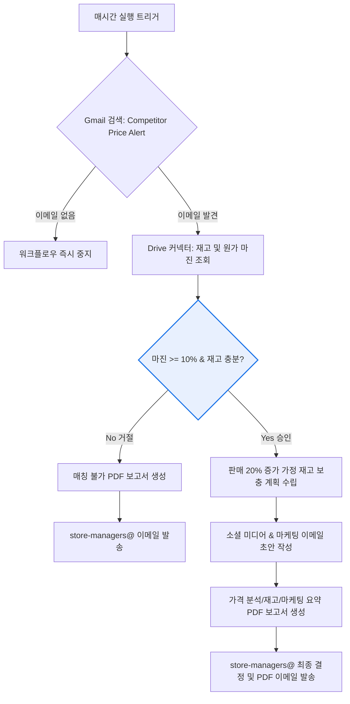
```mermaid
graph TD
    A["매시간 실행 트리거"] --> B{"Gmail 검색: Competitor Price Alert"}
    B -- "이메일 없음" --> C["워크플로우 즉시 중지"]
    B -- "이메일 발견" --> D["Drive 커넥터: 재고 및 원가 마진 조회"]
    D --> E{"마진 >= 10% & 재고 충분?"}
    E -- "No 거절" --> F["매칭 불가 PDF 보고서 생성"]
    F --> G["store-managers@ 이메일 발송"]
    E -- "Yes 승인" --> H["판매 20% 증가 가정 재고 보충 계획 수립"]
    H --> I["소셜 미디어 & 마케팅 이메일 초안 작성"]
    I --> J["가격 분석/재고/마케팅 요약 PDF 보고서 생성"]
    J --> K["store-managers@ 최종 결정 및 PDF 이메일 발송"]
    
    style E fill:#e8f0fe,stroke:#1a73e8,stroke-width:2px
```

#### 🛠️ 워크플로우 에이전트 빌더 실습 체크리스트

다이어그램을 보며 아래 순서대로 Gemini Enterprise **Agent Designer**에서 워크플로우를 직접 조립해봅니다.

- [ ] **① 워크플로우 에이전트 생성**: Agent Designer 진입 → **New Agent** → 유형을 **Workflow** 로 선택 → 이름: `Price & Margin Optimizer`
- [ ] **② 트리거 설정**: 좌측 노드 패널에서 **Schedule Trigger** 드래그 → 실행 주기 `Every 1 hour` 설정
- [ ] **③ Gmail 검색 노드 추가**: Connector 패널 → **Gmail** 검색 노드 추가 → 검색 조건: `subject:"Competitor Price Alert"` 입력
- [ ] **④ 조건 분기 추가**: Flow Control → **Rules-based Branch** 노드 추가
  - `이메일 없음` 경로 → **Stop Workflow** 연결
  - `이메일 발견` 경로 → 다음 단계 연결
- [ ] **⑤ Drive 커넥터 추가**: Connector → **Google Drive** 노드 추가 → 파일 ID 또는 공유 폴더 경로 지정 (재고·원가 마진 스프레드시트)
- [ ] **⑥ 마진 판단 에이전트 노드 추가**: Gemini Agent 노드 추가 → 프롬프트 입력:
  ```
  제공된 재고 및 원가 마진 데이터를 분석하여, 마진이 10% 이상이고 재고가 충분한지 판단하라. JSON으로 {"approve": true/false, "margin_pct": 숫자, "stock_ok": true/false} 형태로만 응답하라.
  ```
  → **Structured Output** 활성화
- [ ] **⑦ 두 번째 조건 분기**: `approve: false` → PDF 보고서 생성 → Gmail 발송 노드 연결 (`store-managers@`)
- [ ] **⑧ 승인 경로 노드 추가**: `approve: true` 경로에 Gemini Agent 노드 → 재고 보충 계획 및 마케팅 이메일 초안 생성
- [ ] **⑨ 최종 PDF 보고서 생성 및 발송**: 보고서 생성 노드 → Gmail 발송 노드 (`store-managers@`) 연결
- [ ] **⑩ 테스트 실행**: 상단 **Test Run** 클릭 → 각 노드 실행 결과 로그 확인 → 정상 동작 여부 검토

> [!TIP]
> **HITL(Human-in-the-Loop) 적용 팁**: ⑧ 단계의 마케팅 초안 발송 전에 **Approval** 노드를 삽입하면, 담당자가 내용을 검토·수정한 뒤 최종 발송하는 안전한 워크플로우를 구성할 수 있습니다.

### 3) 🌐 글로벌 비즈니스 확장 시나리오
1. **공급망 리스크 선제 대응**:
   글로벌 공급망(SCM) 뉴스 및 컨테이너 선적 상태 실시간 웹 검색 ➡️ 항만 파업 감지 시 리스크 수준(High/Medium) AI 판단 ➡️ 대체 운송 루트 제안서 자동 생성 ➡️ SCM 파트장 결재 및 메일 발송 승인 대기 (**Human-in-the-loop**) ➡️ 긴급 대체 노선 예약 메일 발송.
2. **글로벌 고객 VoC 피드백 개선 루프**:
   해외 법인 다국어 오디오/이메일 클레임 수집 ➡️ 현지 언어 번역 및 주요 페인포인트 분류 ➡️ AI가 핵심 부서 배정 제안 ➡️ 제품 책임자 승인 ➡️ 즉시 Jira 티켓 생성 및 협업.

---

